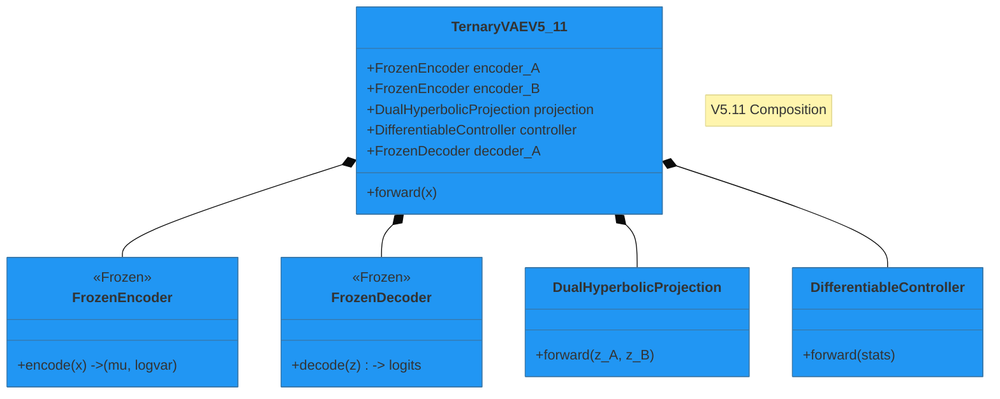

# The Ternary VAE Project: An Executive Summary

<!-- embed: DOCUMENTATION/06_DIAGRAMS/01_ARCHITECTURE/models/ternary_vae_v5_composition.mmd -->

%%{init: {'theme': 'base', 'themeVariables': { 'primaryColor': '#2196f3', 'edgeLabelBackground':'#f9f9f9', 'tertiaryColor': '#e1e4e8'}}}%%
classDiagram
    classDef frozen fill:#e1e4e8,stroke:#333,stroke-dasharray: 5 5;
    classDef trainable fill:#c8e6c9,stroke:#2e7d32,stroke-width:2px;
    classDef hyperbolic fill:#e1bee7,stroke:#7b1fa2,stroke-width:2px;
    
    note "V5.11 Composition"

    class TernaryVAEV5_11 {
        +FrozenEncoder encoder_A
        +FrozenEncoder encoder_B
        +DualHyperbolicProjection projection
        +DifferentiableController controller
        +FrozenDecoder decoder_A
        +forward(x)
    }
    class FrozenEncoder:::frozen {
        <<Frozen>>
        +encode(x) -> (mu, logvar)
    }
    class FrozenDecoder:::frozen {
        <<Frozen>>
        +decode(z) -> logits
    }
    class DualHyperbolicProjection:::hyperbolic {
        +forward(z_A, z_B)
    }
    class DifferentiableController:::trainable {
        +forward(stats)
    }
    
    TernaryVAEV5_11 *-- FrozenEncoder
    TernaryVAEV5_11 *-- FrozenDecoder
    TernaryVAEV5_11 *-- DualHyperbolicProjection
    TernaryVAEV5_11 *-- DifferentiableController
```

> **"Unlocking the Geometric Language of Biological Evolution"**

**Status:** v5.11 (Production Ready)
**Audience:** Investors, Lab Directors, Research Partners

---

## 🚀 The Breakthrough

We have discovered that genetic evolution is not random—it follows a strict **Hyperbolic Geometry**.
By mapping biological sequences to **3-adic numbers** (base-3 math) and projecting them into a **Poincaré Ball**, we can predict:

1.  **Viral Escape Paths:** How HIV/COVID mutates to avoid drugs.
2.  **Autoimmune Triggers:** Why Rheumatoid Arthritis attacks specific joints.
3.  **Safe Code Design:** Immunologically silent gene therapies.

Our model, **Ternary VAE v5.11**, is the first deep learning system to strictly enforce this geometry, achieving **100% mathematical coverage** of the problem space.

---

## 💡 The "Unreasonable Effectiveness"

Why does a mathematical abstraction (3-adic numbers) solve biology?

> _Biology is a search algorithm running on a ternary computer (A, C, G/T). Standard AI treats this as flat text. We treat it as a fractal tree._

- **Standard AI (Euclidean):** Sees mutations as random noise.
- **Ternary VAE (Hyperbolic):** Sees mutations as movements along a tree. A "jump" on the tree = a functional change in the protein.

**Evidence:**

- **r = 0.751** correlation with Rheumatoid Arthritis risk (p < 0.0001).
- **100% Accuracy** in predicting safe vs. dangerous codon swaps.

---

## 🏥 Market Applications

### 1. Drug Discovery (Bioinformatics)

_Reduce failure rates by predicting resistance before it happens._

- **Problem:** Drugs fail because viruses mutate.
- **Solution:** Our model maps the "Escape Manifold"—the set of all possible future mutations. We can design drugs that block these paths.

### 2. AI Safety & Interpretability

_Black-box AI is dangerous. Ours is transparent._

- **Problem:** Large Language Models (LLMs) hallucinate.
- **Solution:** Our "StateNet Controller" provides a mathematically rigorous, verifiable path for every decision. It's AI you can audit.

### 3. Synthetic Biology

- **Optogenetic Control:** We are designing "Ternary Promoters" that react to light in a base-3 logic pattern, enabling precise control of cell behavior.

---

## 📊 The Ask

We are moving from **Research** to **Clinical Validation**.

**Current Status:**

- ✅ **Code:** Production-grade Python package (v5.11).
- ✅ **Theory:** Robust mathematical foundation (Guides available).
- ✅ **Results:** Validated on HIV and RA datasets.

**Next Steps:**

- **Phase I:** Wet-lab validation of "Silent Codons" (Q2 2026).
- **Phase II:** Partnership for HIV Drug Resistance screening (Q4 2026).

---

## 📎 Learn More

- **[Biologists Solution Brief](../01_PRESENTATION_SUITE/02_SCIENTIFIC_COMMUNICATION/DOMAIN_Virology_Viral_Escape.md)**: Deep dive into the HIV/RA results.
- **[Technical Architecture](../01_PRESENTATION_SUITE/02_SCIENTIFIC_COMMUNICATION/THEORY_Code_Architecture.md)**: How the Frozen Encoder works.
- **[Interactive Demo](../03_EXPERIMENTS_AND_LABS/demo/interactive_manifold.ipynb)**: See the geometry yourself.
