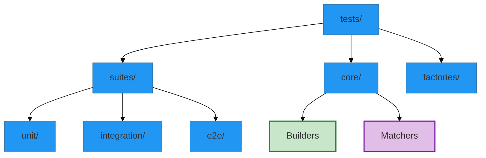

# Testing Patterns

## 1. The Factory Pattern

Used for data generation. Centralizes the rules for creating valid entities.

- **Location**: `tests/factories/`
- **Usage**:

<!-- embed: DOCUMENTATION/06_DIAGRAMS/04_INFRASTRUCTURE/testing/suite_map.mmd -->

%%{init: {'theme': 'base', 'themeVariables': { 'primaryColor': '#2196f3', 'edgeLabelBackground':'#f9f9f9', 'tertiaryColor': '#e1e4e8'}}}%%
graph TD
    classDef frozen fill:#e1e4e8,stroke:#333,stroke-dasharray: 5 5;
    classDef trainable fill:#c8e6c9,stroke:#2e7d32,stroke-width:2px;
    classDef hyperbolic fill:#e1bee7,stroke:#7b1fa2,stroke-width:2px;
    
    %% Testing Layout

    Root[tests/]
    Root --> Suites[suites/]
    Root --> Core[core/]
    Root --> Factories[factories/]
    
    Suites --> Unit[unit/]
    Suites --> Integ[integration/]
    Suites --> E2E[e2e/]
    
    Core --> Builders:::trainable
    Core --> Matchers:::hyperbolic
```
%%{init: {'theme': 'base', 'themeVariables': { 'primaryColor': '#2196f3', 'edgeLabelBackground':'#f9f9f9', 'tertiaryColor': '#e1e4e8'}}}%%
graph TD
    classDef frozen fill:#e1e4e8,stroke:#333,stroke-dasharray: 5 5;
    classDef trainable fill:#c8e6c9,stroke:#2e7d32,stroke-width:2px;
    classDef hyperbolic fill:#e1bee7,stroke:#7b1fa2,stroke-width:2px;
    
    %% Testing Layout

    Root[tests/]
    Root --> Suites[suites/]
    Root --> Core[core/]
    Root --> Factories[factories/]
    
    Suites --> Unit[unit/]
    Suites --> Integ[integration/]
    Suites --> E2E[e2e/]
    
    Core --> Builders:::trainable
    Core --> Matchers:::hyperbolic
```
%%{init: {'theme': 'base', 'themeVariables': { 'primaryColor': '#2196f3', 'edgeLabelBackground':'#f9f9f9', 'tertiaryColor': '#e1e4e8'}} }%%
graph TD
    classDef frozen fill:#e1e4e8,stroke:#333,stroke-dasharray: 5 5;
    classDef trainable fill:#c8e6c9,stroke:#2e7d32,stroke-width:2px;
    classDef hyperbolic fill:#e1bee7,stroke:#7b1fa2,stroke-width:2px;
    
    %% Testing Layout

    Root[tests/]
    Root --> Suites[suites/]
    Root --> Core[core/]
    Root --> Factories[factories/]
    
    Suites --> Unit[unit/]
    Suites --> Integ[integration/]
    Suites --> E2E[e2e/]
    
    Core --> Builders:::trainable
    Core --> Matchers:::hyperbolic
```
%%{init: {'theme': 'base', 'themeVariables': { 'primaryColor': '#2196f3', 'edgeLabelBackground':'#f9f9f9', 'tertiaryColor': '#e1e4e8'}} }%%
graph TD
    classDef frozen fill:#e1e4e8,stroke:#333,stroke-dasharray: 5 5;
    classDef trainable fill:#c8e6c9,stroke:#2e7d32,stroke-width:2px;
    classDef hyperbolic fill:#e1bee7,stroke:#7b1fa2,stroke-width:2px;
    
    %% Testing Layout

    Root[tests/]
    Root --> Suites[suites/]
    Root --> Core[core/]
    Root --> Factories[factories/]
    
    Suites --> Unit[unit/]
    Suites --> Integ[integration/]
    Suites --> E2E[e2e/]
    
    Core --> Builders:::trainable
    Core --> Matchers:::hyperbolic
```

```python
user = UserFactory.build(active=True)
```

## 2. The Page Object Model (POM)

Used for E2E testing to abstract the UI.

- **Location**: `tests/e2e_support/pages/`
- **Rule**: Tests never contain CSS/XPath selectors. Only Pages do.
- **Usage**:
  ```python
  login_page.enter_credentials(user.email, user.password)
  dashboard = login_page.submit()
  ```

## 3. The Builder Pattern

Used to construct complex scenarios.

- **Location**: `tests/core/builders/`
- **Usage**:
  ```python
  scenario = ScenarioBuilder()\
      .with_logged_in_user()\
      .with_product_in_cart()\
      .build()
  ```
