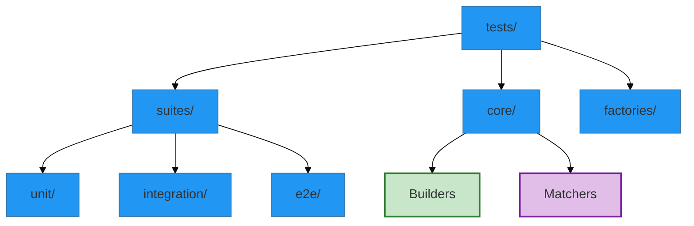

# Validation Strategy Inventory & Roadmap

**Purpose**: This document merges all testing plans (`01_PLANS`), suites (`02_SUITES`), and factory architectures (`03_TEST_FRAMEWORK_DOCS`) into a single actionable roadmap.

## 1. The Data Layer (Factories)

We will replace manual tensor creation with semantic Factories in `tests/factories/`.

| Factory                    | Responsibility                                                    | Status  |
| :------------------------- | :---------------------------------------------------------------- | :------ | ------ | ------- |
| `TernaryOperationFactory`  | Generates valid ternary operations (e.g., `((-1, 0), 1)`).        | 🔴 Todo |
| `PoincareEmbeddingFactory` | Generates valid points on the Poincaré disk ($                    | x       | < 1$). | 🔴 Todo |
| `ModelConfigFactory`       | Generates `TernaryVAEV5_11` configurations (Small/Large/OptionC). | 🔴 Todo |
| `TrainingStateFactory`     | Generates mock training histories for Homeostasis testing.        | 🔴 Todo |
| `BioSequenceFactory`       | Generates synthetic DNA/RNA sequences for upstream testing.       | 🔴 Todo |

## 2. The Core Layer (Abstractions)

We will build fluent interfaces in `tests/core/` to simplify test logic.

### Builders (`tests/core/builders/`)

- **`VAEBuilder`**:
  ```python
  model = VAEBuilder().with_frozen_encoder().with_dual_projection().build()
  ```
- **`TrainingLoopBuilder`**:
  ```python
  loop = TrainingLoopBuilder().with_model(model).with_epochs(1).build()
  ```

### Matchers (`tests/core/matchers/`)

- **`HyperbolicMatcher`**:
  - `assert_on_manifold(tensor)`
  - `assert_geodesic_distance(a, b, expected)`
- **`GradientMatcher`**:
  - `assert_has_gradient(module)`
  - `assert_frozen(module)`

### Drivers (`tests/core/drivers/`)

- **`TrainingDriver`**: Wraps the `Trainer` class to spy on metrics.
- **`ValidationDriver`**: Wraps `downstream_validation.py` for E2E tests.

## 3. The Execution Layer (Suites)

Consolidating `02_SUITES/*` into the new structure `tests/suites/`.

<!-- embed: DOCUMENTATION/06_DIAGRAMS/04_INFRASTRUCTURE/testing/suite_map.mmd -->

%%{init: {'theme': 'base', 'themeVariables': { 'primaryColor': '#2196f3', 'edgeLabelBackground':'#f9f9f9', 'tertiaryColor': '#e1e4e8'}}}%%
graph TD
    classDef frozen fill:#e1e4e8,stroke:#333,stroke-dasharray: 5 5;
    classDef trainable fill:#c8e6c9,stroke:#2e7d32,stroke-width:2px;
    classDef hyperbolic fill:#e1bee7,stroke:#7b1fa2,stroke-width:2px;
    
    %% Testing Layout

    Root[tests/]
    Root --> Suites[suites/]
    Root --> Core[core/]
    Root --> Factories[factories/]
    
    Suites --> Unit[unit/]
    Suites --> Integ[integration/]
    Suites --> E2E[e2e/]
    
    Core --> Builders:::trainable
    Core --> Matchers:::hyperbolic
```

### Regression Suite (`tests/suites/regression/`)

_Source: `02_SUITES/UNIT_SUITE.md`_

- [ ] **Geometry Invariants**: Triangle inequality, Möbius addition identity.
- [ ] **Model Invariants**: Output shapes, Parameter counts.
- [ ] **Loss Invariants**: KL divergence non-negativity.

### Integration Suite (`tests/suites/integration/`)

_Source: `02_SUITES/INTEGRATION_SUITE.md`_

- [x] **Pipeline Smoke**: `test_ai_environment_smoke.py` passes.
- [ ] **Homeostasis Flow**: Pending `TrainingLoopBuilder`.
- _(Legacy Tests archived to `tests/fixtures/legacy/`)_

### Scientific Suite (`tests/suites/e2e/`)

_Source: `02_SUITES/SCIENTIFIC_SUITE.md`_

- [x] **Pipeline Smoke**: `test_scientific.py` passes (Mocked).
- [ ] **Full Validation**: Requires trained v5.11 checkpoint.

## 4. Documentation Strategy

**Action**: Deprecate `01_PLANS` and `02_SUITES` in favor of `03_TEST_FRAMEWORK_DOCS`.

1.  **Merge** `MASTER_TEST_STRATEGY.md` -> `strategy/master_test_plan.md`
2.  **Merge** `CI_CD_PLAN.md` -> `strategy/ci_cd_workflow.md`
3.  **Merge** `*_SUITE.md` -> `suites/*.md`

## 5. Next Steps

1.  Implement `BaseFactory` (Done).
2.  Implement `TernaryOperationFactory` (High Priority).
3.  Refactor `test_models.py` to use `VAEBuilder`.
