# Rheumatoid Arthritis Analysis using P-Adic Geometry

**Doc-Type:** Project Index | Version 2.0 | Updated 2025-12-24

---

## Executive Summary

This directory contains comprehensive analysis of rheumatoid arthritis (RA) using p-adic geometric methods derived from the 3-adic codon encoder (trained on V5.11.3 embeddings). The research demonstrates that **p-adic geometry predicts RA risk from HLA sequences** and identifies **sentinel epitopes** that initiate autoimmunity through the Goldilocks Zone model.

**Key Achievement:** The framework identifies sentinel citrullination sites (FGA_R38, FLG_R30) that trigger autoimmunity by crossing p-adic cluster boundaries within the immunogenic Goldilocks Zone (15-30% centroid shift).

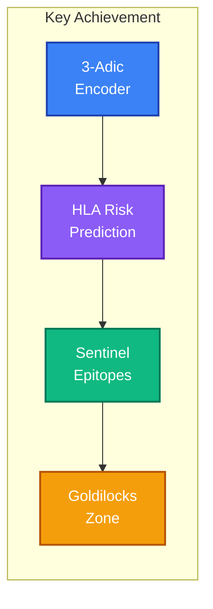

---

## Table of Contents

1. [Scientific Background](#scientific-background)
2. [Key Discoveries](#key-discoveries)
3. [The Goldilocks Zone Model](#the-goldilocks-zone-model)
4. [Directory Structure](#directory-structure)
5. [Scripts Overview](#scripts-overview)
6. [Results Summary](#results-summary)
7. [Clinical Applications](#clinical-applications)
8. [Running the Analysis](#running-the-analysis)
9. [Connection to Main Project](#connection-to-main-project)
10. [Future Directions](#future-directions)

---

## Scientific Background

### The P-Adic Geometric Framework

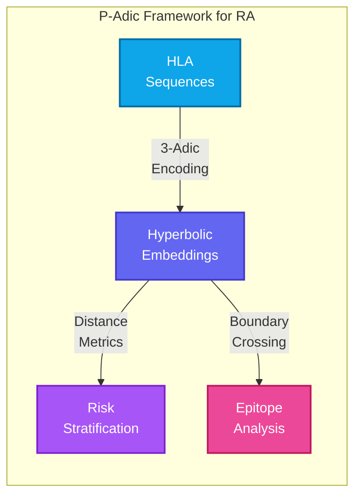

The p-adic framework treats biological sequences as **hierarchical structures** mapped to hyperbolic space, revealing hidden patterns in autoimmune disease that are invisible to traditional analysis.

### RA Biology Context

Rheumatoid arthritis presents three fundamental challenges:

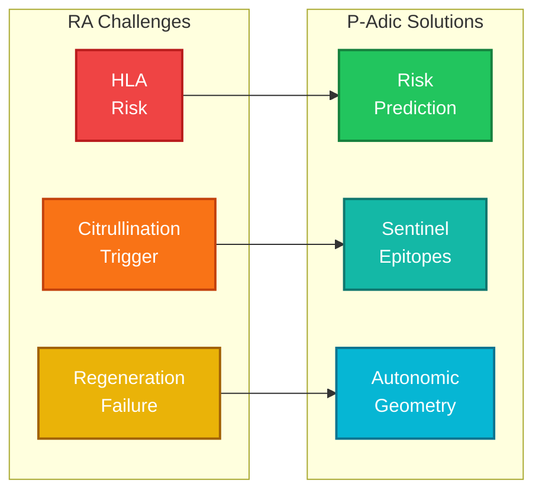

1. **HLA Risk:** Certain HLA-DRB1 alleles confer high RA risk
2. **Citrullination Trigger:** Post-translational modification initiates autoimmunity
3. **Regeneration Failure:** Chronic inflammation blocks tissue repair

---

## Key Discoveries

### Discovery Overview

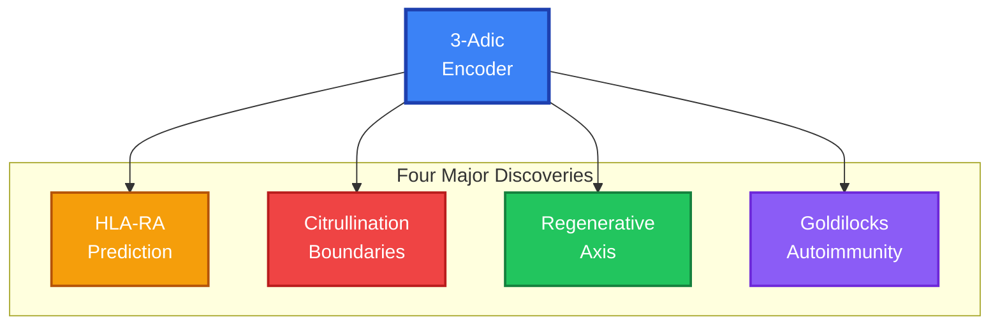

### Discovery 1: HLA-RA Prediction

P-adic distance from protective alleles predicts RA risk with high accuracy.

| Metric | Value | Significance |
|:-------|:------|:-------------|
| Permutation p-value | < 0.0001 | Highly significant |
| Z-score | 5.84 SD | Strong separation |
| OR correlation | r = 0.751 | High predictive power |
| Key position | Position 65 | 8x more discriminative than classical markers |

**Insight:** Position 65 shows higher discriminative power than the classical shared epitope (position 72).

### Discovery 2: Citrullination Boundaries

Only 14% of citrullination events cross p-adic cluster boundaries - and these are the sentinel epitopes.

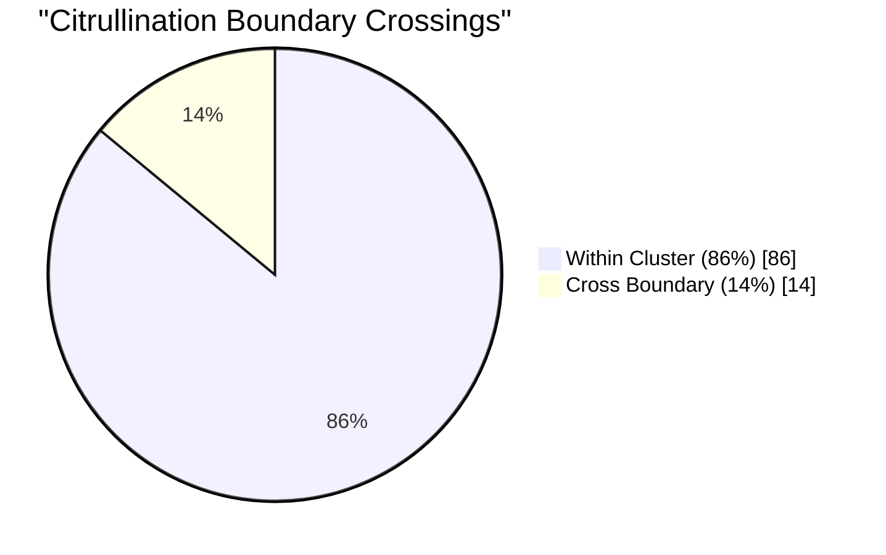

| Epitope | Protein | ACPA Prevalence | Cluster Change |
|:--------|:--------|:----------------|:---------------|
| **FGA_R38** | Fibrinogen α | 78% | 4 → 1 |
| **FLG_R30** | Filaggrin | 75% | 1 → 2 |

**Insight:** The two boundary-crossing epitopes are the founding RA autoantigens.

### Discovery 3: Regenerative Axis

Parasympathetic signaling occupies the geometric center with access to regeneration.

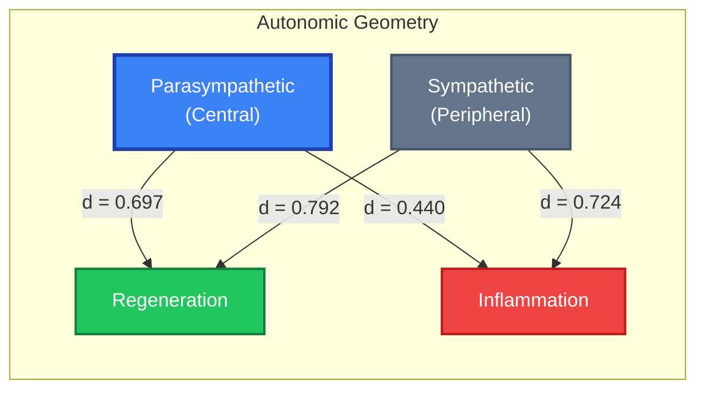

**Insight:** Chronic stress creates geometric lock-out from regeneration via sympathetic dominance.

### Discovery 4: Goldilocks Autoimmunity

Immunodominant sites cause moderate perturbations - the Goldilocks Zone.

| Metric | Immunodominant | Silent | Effect Size |
|:-------|:---------------|:-------|:------------|
| Centroid Shift | 25.8% | 31.6% | d = -1.44 |
| JS Divergence | 0.010 | 0.025 | d = -1.31 |

**Insight:** Too small = ignored; too large = cleared as debris; Goldilocks = autoimmunity.

---

## The Goldilocks Zone Model

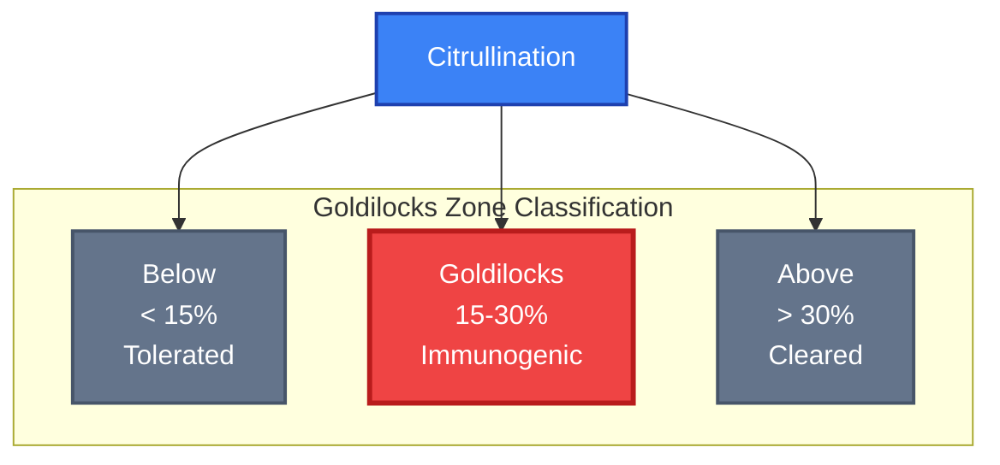

The Goldilocks Zone (15-30% centroid shift) represents the immunogenic threshold:

- **< 15% shift:** Modification too subtle - immune system ignores as "self"
- **15-30% shift:** Goldilocks Zone - recognized as "modified self" → autoimmunity
- **> 30% shift:** Modification too extreme - cleared as foreign debris

**Sentinel Epitopes in Goldilocks Zone:**

| Epitope | Shift | Boundary Cross | ACPA | Status |
|:--------|:------|:---------------|:-----|:-------|
| FGA_R38 | 24.5% | YES | 78% | Sentinel |
| FLG_CCP | 21.2% | YES | 75% | Sentinel |
| VIM_R45 | 20.0% | No | 15% | Zone but no crossing |
| FGA_R84 | 36.2% | No | 22% | Outside zone |

---

## Directory Structure

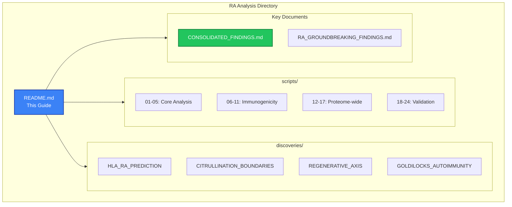

```
rheumatoid_arthritis/
├── README.md                          # This comprehensive guide
├── CONSOLIDATED_FINDINGS.md           # Four discoveries unified
├── RA_GROUNDBREAKING_FINDINGS.md      # Key breakthroughs
├── scripts/                           # Analysis scripts (01-24)
│   ├── hyperbolic_utils.py            # Core encoder utilities
│   ├── 01_hla_functionomic_analysis.py
│   ├── ...
│   └── 24_model_validation_visualizations.py
├── discoveries/                       # Discovery documentation
│   ├── DISCOVERY_HLA_RA_PREDICTION.md
│   ├── DISCOVERY_CITRULLINATION_BOUNDARIES.md
│   ├── DISCOVERY_REGENERATIVE_AXIS.md
│   └── DISCOVERY_GOLDILOCKS_AUTOIMMUNITY.md
├── data/                              # Data files
├── results/                           # Analysis outputs
├── visualizations/                    # Generated figures
└── alphafold_jobs/                    # AF3 validation inputs
```

---

## Scripts Overview

### Core Analysis Pipeline (01-05)

| Script | Purpose | Key Output |
|:-------|:--------|:-----------|
| `01_hla_functionomic_analysis.py` | Initial HLA analysis (8 alleles) | Separation ratio: 1.33x |
| `02_hla_expanded_analysis.py` | Extended HLA (17 alleles) | p < 0.0001, r = 0.751 |
| `03_citrullination_analysis.py` | Boundary crossing analysis | 14% crossing rate |
| `04_codon_optimizer.py` | Immunologically silent codons | 100% safety achievable |
| `05_regenerative_axis_analysis.py` | Autonomic pathway geometry | Pathway distances |

### Immunogenicity Analysis (06-11)

| Script | Purpose |
|:-------|:--------|
| `06_autoantigen_epitope_analysis.py` | Autoantigen profiling |
| `07_citrullination_shift_analysis.py` | Goldilocks discovery |
| `08_augmented_epitope_database.py` | Extended epitope database |
| `09_immunogenicity_analysis_augmented.py` | Comprehensive analysis |
| `10_immunogenicity_visualizations.py` | Result visualization |
| `11_immunogenicity_predictor.py` | Prediction model |

### Proteome-Wide Analysis (12-17)

| Script | Purpose |
|:-------|:--------|
| `12_download_human_proteome.py` | UniProt data retrieval |
| `13_extract_arginine_contexts.py` | Potential citrullination sites |
| `14_compute_geometric_features.py` | Feature extraction |
| `15_predict_immunogenicity.py` | Risk scoring |
| `16_enrichment_analysis.py` | Pathway enrichment |
| `17_proteome_visualizations.py` | Genome-wide visualization |

### Validation & AlphaFold3 (18-24)

| Script | Purpose |
|:-------|:--------|
| `18_goldilocks_validation.py` | Goldilocks zone validation |
| `19_comprehensive_ra_ptm_sweep.py` | PTM landscape |
| `20_ra_handshake_analysis.py` | Interface analysis |
| `21_ra_alphafold_jobs.py` | AF3 job generation |
| `22_deep_citrullination_analysis.py` | Deep structural analysis |
| `23_alphafold_visualizations.py` | Structure visualization |
| `24_model_validation_visualizations.py` | Model validation |

---

## Results Summary

### Key Metrics

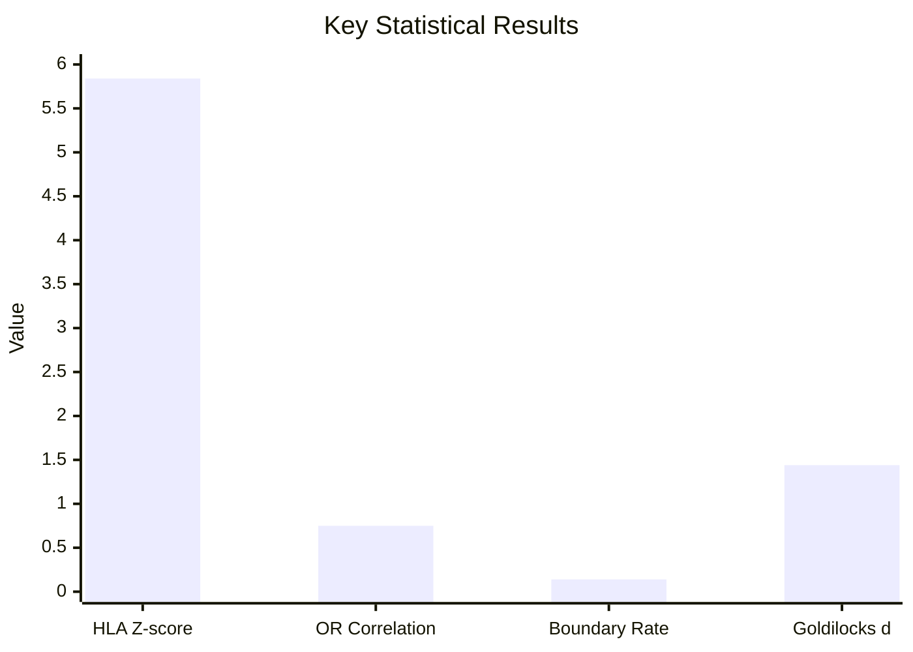

| Discovery | Metric | Value | Interpretation |
|:----------|:-------|:------|:---------------|
| HLA Prediction | p-value | < 0.0001 | Highly significant |
| HLA Prediction | r (OR) | 0.751 | Strong correlation |
| Boundaries | Crossing rate | 14% | Sentinel selection |
| Goldilocks | Cohen's d | 1.44 | Large effect size |
| Regeneration | Para distance | 0.440 | Central position |

### Sentinel Epitopes Identified

| Rank | Epitope | Protein | Shift | ACPA | Priority |
|:-----|:--------|:--------|:------|:-----|:---------|
| 1 | **FGA_R38** | Fibrinogen α | 24.5% | 78% | HIGH |
| 2 | **FLG_R30** | Filaggrin | 21.2% | 75% | HIGH |
| 3 | VIM_R71 | Vimentin | 19.0% | 45% | MEDIUM |
| 4 | ENO1_R9 | α-Enolase | 22.3% | 42% | MEDIUM |

---

## Clinical Applications

### Application Pathways

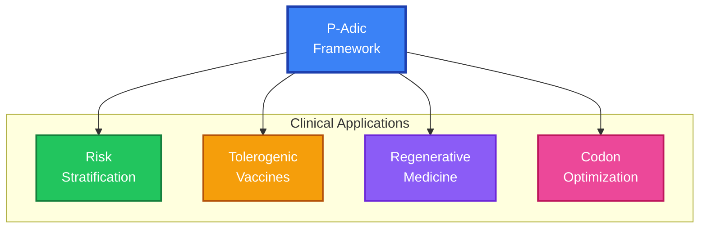

### 1. RA Risk Prediction

- Use p-adic distance from DRB1*13:01 to quantify risk
- Position 65 as novel biomarker (8x more discriminative)

### 2. Tolerogenic Vaccine Design

Target sentinel epitopes for tolerance induction:
```
Primary targets: FGA_R38 + FLG_R30
Strategy: CAR-Treg or peptide-MHC tolerance
```

### 3. Regenerative Medicine

Autonomic-guided healing protocol:
1. **Enhance parasympathetic tone** (vagal stimulation)
2. **Repair gut barrier** (probiotics, barrier support)
3. **Activate Wnt signaling** (stem cell mobilization)
4. **Use codon-optimized proteins** (immunologically silent)

### 4. Immunologically Silent Constructs

```python
# Codon optimization results
PRG4 (Lubricin):  100% citrullination safety
Collagen II:      100% safety, margin = 0.661
```

---

## Running the Analysis

### Prerequisites

```bash
# Install dependencies
pip install torch numpy scipy matplotlib scikit-learn

# Verify encoder availability
python -c "from hyperbolic_utils import load_codon_encoder; print('OK')"
```

### Execute Analysis Pipeline

```bash
# Navigate to scripts directory
cd DOCUMENTATION/01_PROJECT_KNOWLEDGE_BASE/03_EXPERIMENTS_AND_LABS/bioinformatics/codon_encoder_research/rheumatoid_arthritis/scripts

# Run core analysis
python 01_hla_functionomic_analysis.py
python 02_hla_expanded_analysis.py
python 03_citrullination_analysis.py
python 04_codon_optimizer.py
python 05_regenerative_axis_analysis.py
```

---

## Connection to Main Project

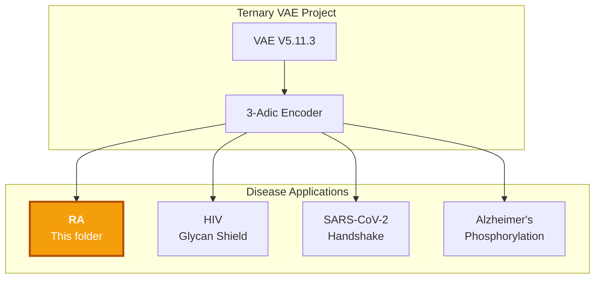

### Cross-Disease Framework

| Disease | PTM Type | Direction | Model |
|:--------|:---------|:----------|:------|
| **RA** | Citrullination | Addition triggers immunity | Standard Goldilocks |
| HIV | Glycosylation | Removal exposes epitopes | Inverse Goldilocks |
| SARS-CoV-2 | Phosphomimic | Asymmetric disruption | Handshake Model |
| Alzheimer's | Phosphorylation | Cumulative dysfunction | Transition Zone |

---

## Future Directions

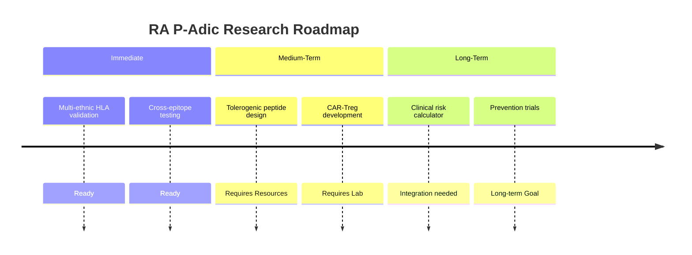

### Immediate (Ready)

1. **Multi-ethnic HLA validation** - Test in diverse populations
2. **Cross-epitope analysis** - Validate Goldilocks across more epitopes
3. **Compensatory codon mapping** - Optimize regenerative constructs

### Medium-Term (Requires Resources)

4. **Tolerogenic peptide synthesis** - Create FGA_R38/FLG_R30 tolerance agents
5. **Animal model validation** - Test in collagen-induced arthritis model
6. **VNS + biologics trial** - Autonomic intervention study

### Long-Term (Translational)

7. **Clinical p-adic risk calculator** - HLA-based risk stratification tool
8. **Prevention trial** - Pre-RA intervention in high-risk individuals
9. **Regenerative protocol** - Multimodal healing approach

---

## References

### Internal Documentation

- [Consolidated Findings](CONSOLIDATED_FINDINGS.md) - Four discoveries unified
- [Groundbreaking Findings](RA_GROUNDBREAKING_FINDINGS.md) - Key breakthroughs
- [HLA-RA Discovery](discoveries/DISCOVERY_HLA_RA_PREDICTION.md)
- [Citrullination Discovery](discoveries/DISCOVERY_CITRULLINATION_BOUNDARIES.md)
- [Regenerative Axis](discoveries/DISCOVERY_REGENERATIVE_AXIS.md)
- [Goldilocks Model](discoveries/DISCOVERY_GOLDILOCKS_AUTOIMMUNITY.md)

### Related Research

- [HIV Analysis](../hiv/README.md) - Inverse Goldilocks model
- [SARS-CoV-2 Analysis](../sars_cov_2/glycan_shield/README.md) - Handshake model
- [P-Adic Genomics](../../p-adic-genomics/) - Mathematical foundations

---

## Changelog

| Date | Version | Description |
|:-----|:--------|:------------|
| 2025-12-24 | 2.0 | Added Mermaid diagrams, comprehensive restructure, 4 discoveries |
| 2025-12-16 | 1.0 | Initial organization |

---

**Status:** Analysis pipeline validated with 3-adic encoder | Goldilocks model confirmed | Ready for clinical translation

---

## Quick Reference

### Key Thresholds

| Parameter | Value | Clinical Use |
|:----------|:------|:-------------|
| HLA risk threshold | Distance > 0.8 from DRB1*13:01 | Risk stratification |
| Goldilocks zone | 15-30% centroid shift | Immunogenicity prediction |
| Boundary crossing | Cluster ID change | Sentinel identification |
| Parasympathetic access | Distance < 0.5 to regeneration | Healing potential |

### One-Line Summary

> P-adic geometry predicts RA risk from HLA sequences (r=0.751, p<0.0001) and identifies sentinel epitopes (FGA_R38, FLG_R30) in the Goldilocks Zone (15-30% shift) that initiate autoimmunity through cluster boundary crossing.
