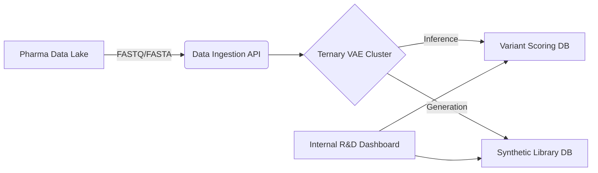

# Enterprise Integration Guide

**For**: CTOs, IT Directors, DevOps Leads @ Pharma

## 1. Deployment Architecture

The Ternary VAE is delivered as a Dockerized Microservice.



## 2. System Requirements

- **Min Specs**: 1x NVIDIA A10G (24GB VRAM), 32GB RAM.
- **Recommended**: Kubernetes Cluster with auto-scaling GPU nodes.
- **Storage**: 1TB NVMe for latent cache.

## 3. API Endpoints

### `POST /score_variants`

Input: List of protein sequences.
Output: JSON with `fitness_score`, `uncertainty`, `escape_potential`.

```json
{
  "sequence_id": "omicron_xbb_1_5",
  "score": 0.98,
  "risk_level": "HIGH",
  "latent_coords": [-0.5, 0.2, 0.8, ...]
}
```

### `POST /generate_library`

Input: `target_protein` (e.g., "P53"), `count` (e.g., 1000).
Output: FASTA file of stable, diverse variants.

## 4. Security & Compliance

- **On-Premise**: The model runs entirely within your VPC. No data leaves your firewall.
- **Air-Gapped**: Supports offline deployment for sensitive IP.
- **Audit Logs**: Full logging of all inference requests for IP tracking.
