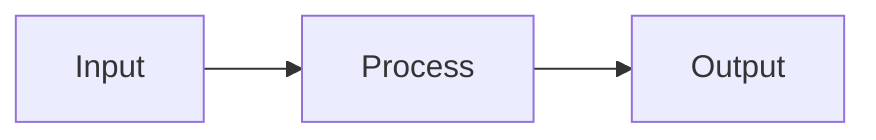

# Content Standards

> **Guidelines for consistent, professional documentation across the project.**

---

## Document Structure

### Heading Hierarchy

```markdown
# Document Title (H1) - One per document
## Major Section (H2)
### Subsection (H3)
#### Detail (H4) - Use sparingly
```

**Rules:**
- One H1 per document (the title)
- H2 for major sections
- H3 for subsections within H2
- Avoid H4+ unless absolutely necessary
- Use sentence case for headings (capitalize first word only)

### Standard Sections

Every document should include:

1. **Title** (H1) - Clear, descriptive name
2. **Purpose statement** - One-line description in blockquote
3. **Content** - Main body organized by H2 sections
4. **Last updated** - Date at bottom

**Optional sections:**
- Table of contents (for documents >500 lines)
- Related documents
- Changelog

---

## Claim Language Levels

Use precise language based on validation status:

| Level | Status | Language to Use | Example |
|:------|:-------|:----------------|:--------|
| **1** | Mathematically proven | "is", "proves", "demonstrates" | "The hyperbolic projection preserves hierarchy." |
| **2** | Externally corroborated | "correlates with", "validated by" | "Glycan predictions correlate with AlphaFold3 (r=-0.89)." |
| **3** | Internally consistent | "suggests", "indicates", "our analysis shows" | "Our analysis suggests this mutation confers resistance." |
| **4** | Hypothesized | "may", "could", "we hypothesize", "pending" | "This approach may extend to other pathogens." |

### Forbidden Terms (External Documents)

These terms reveal proprietary methodology and must NOT appear in Tier 1 or Tier 2 documents:

| Forbidden | Use Instead |
|:----------|:------------|
| p-adic | proprietary encoding |
| ternary | specialized representation |
| hyperbolic | geometric, non-Euclidean |
| non-Archimedean | proprietary metric |
| 3-adic | specialized distance metric |
| Poincare ball | geometric embedding space |

**Exception**: Tier 3 Technical documents may use these terms.

---

## Writing Style

### Voice and Tone

- **Active voice** preferred: "The model predicts..." not "Predictions are made by..."
- **Professional but accessible**: Avoid jargon where simpler terms work
- **Confident but precise**: Use appropriate claim language levels
- **Concise**: Remove unnecessary words

### Technical Writing

- Define acronyms on first use: "Variational Autoencoder (VAE)"
- Use consistent terminology throughout
- Include units for all measurements
- Provide context for numbers: "92.4% accuracy (vs. baseline 78.2%)"

### Formatting

- **Bold** for emphasis and key terms
- *Italics* for introducing new terms or titles
- `Code formatting` for file names, commands, variable names
- > Blockquotes for callouts and important notes

---

## Tables

Use tables for:
- Comparing options
- Listing items with attributes
- Presenting data

**Format:**
```markdown
| Column A | Column B | Column C |
|:---------|:---------|:---------|
| Left-aligned | Left-aligned | Left-aligned |
```

---

## Code Examples

### Inline Code
Use backticks for: file names, function names, commands, paths.

Example: The `train.py` script calls `TernaryVAE.forward()`.

### Code Blocks
Use fenced code blocks with language specification:

```python
def example():
    """Docstring follows Google style."""
    return result
```

---

## Images and Diagrams

### Mermaid Diagrams
Preferred for: architecture, workflows, class diagrams.

```markdown

```

### External Images
- Store in `/DOCUMENTATION/06_DIAGRAMS/` or section-specific `assets/` folders
- Use relative paths: ``
- Include alt text for accessibility
- Prefer PNG for diagrams, JPEG for photos

---

## Links

### Internal Links
Use relative paths from the current document:

```markdown
[Link Text](../01_PROJECT_KNOWLEDGE_BASE/README.md)
```

### External Links
Include context:

```markdown
See the [AlphaFold3 documentation](https://alphafold.com/docs) for setup details.
```

### Anchor Links
Link to sections within documents:

```markdown
See [Claim Language Levels](#claim-language-levels) above.
```

---

## File Naming

### Conventions
- UPPERCASE for important documents: `README.md`, `CONTRIBUTING.md`
- lowercase_with_underscores for most files: `setup_guide.md`
- Numbered prefixes for ordered content: `01_introduction.md`, `02_theory.md`
- Clear, descriptive names

### Naming Patterns

| Type | Pattern | Example |
|:-----|:--------|:--------|
| README | `README.md` | Section overviews |
| Discovery | `DISCOVERY_*.md` | `DISCOVERY_HIV_RESISTANCE.md` |
| Case study | `CASE_STUDY_*.md` | `CASE_STUDY_VIRAL_ESCAPE.md` |
| Domain explainer | `DOMAIN_*.md` | `DOMAIN_Virology.md` |
| Template | `TEMPLATE_*.md` | `TEMPLATE_README.md` |
| Plan | `PLAN_*.md` | `PLAN_Q1_2025.md` |

---

## Citations and References

### In-Document Citations
Use footnote-style for academic references:

```markdown
This follows established theory [1].

---
**References:**
1. Author, "Title", Journal, Year. DOI: xxx
```

### Linking to Project Documents
Always use relative links, not absolute paths.

---

## Document Lifecycle

### Creation
1. Choose appropriate template from [TEMPLATE_LIBRARY.md](TEMPLATE_LIBRARY.md)
2. Fill in all required sections
3. Apply content standards
4. Run through [REVIEW_CHECKLIST.md](REVIEW_CHECKLIST.md)

### Updates
- Update "Last updated" date
- Note significant changes in document or changelog
- Verify links still work

### Archival
- Move to appropriate archive folder
- Add deprecation notice at top
- Update links pointing to archived document

---

## Tier-Specific Guidelines

### Tier 1 (Public)
- No forbidden terms
- Claim level 2+ only (externally validated)
- Accessible to non-specialists
- Include validation protocols

### Tier 2 (Investor)
- Business-focused language
- Quantified claims with sources
- Market context provided
- No forbidden terms

### Tier 3 (Technical)
- Full technical detail allowed
- All claim levels acceptable
- Forbidden terms may be used
- Include implementation details

---

## Quality Checklist

Before publishing any document:

- [ ] Single H1 title
- [ ] Purpose statement present
- [ ] Claim language appropriate for tier
- [ ] No forbidden terms (Tier 1/2)
- [ ] All links verified
- [ ] Images have alt text
- [ ] Last updated date current
- [ ] Spell-checked

See [REVIEW_CHECKLIST.md](REVIEW_CHECKLIST.md) for complete pre-publication checklist.

---

*Last updated: 2025-12-24*
