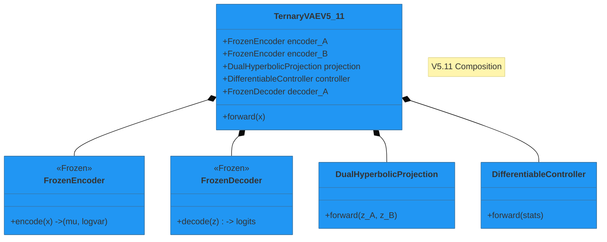

# Ternary VAE Bioinformatics Documentation

**Unified Documentation Hub**

This platform is the single source of truth for the project, organized into three primary branches:

## 🧠 01 Project Knowledge Base (`/01_PROJECT_KNOWLEDGE_BASE`)

_The "Static" Truth. Immutable concepts, standards, and assets._

- **00 Strategy & Vision**: Pitch decks, long-term goals.
- **01 Presentation Suite**: Public-facing assets (Grants, Posters).
- **02 Theory**: Mathematical and Biological foundations.
- **03 Experiments**: Juypter notebooks and research logs.
- **04 Scientific History**: Archive of past discoveries.
- **05 Legal & IP**: Licenses, Notices, and IP Defensibility plans.

## 🏗️ 02 Project Management (`/02_PROJECT_MANAGEMENT`)

_The "Active" Execution. Mutable plans, tasks, and health checks._

- **00 Tasks**: Actionable P0/P1 items.
- **01 Roadmaps & Plans**: Quarterly strategies and improvement plans.
- **02 Code Health Metrics**: Linting, auditing, and technical debt reports.
- **03 Archive**: Deprecated plans.

## 🎯 03 Presentation Tiers (`/03_PRESENTATION_TIERS`)

_Tailored packages for specific stakeholders._

- **01 Tier 1 (Public)**: General audience, high-level impact.
- **02 Tier 2 (Investor)**: Venture Capital, market analysis, defensibility.
- **03 Tier 3 (Technical)**: Deep dives for technical due diligence.

## 📐 Architecture Overview

<!-- embed: DOCUMENTATION/06_DIAGRAMS/01_ARCHITECTURE/models/ternary_vae_v5_composition.mmd -->



%%{init: {'theme': 'base', 'themeVariables': { 'primaryColor': '#2196f3', 'edgeLabelBackground':'#f9f9f9', 'tertiaryColor': '#e1e4e8'}}}%%
classDiagram
classDef frozen fill:#e1e4e8,stroke:#333,stroke-dasharray: 5 5;
classDef trainable fill:#c8e6c9,stroke:#2e7d32,stroke-width:2px;
classDef hyperbolic fill:#e1bee7,stroke:#7b1fa2,stroke-width:2px;

    note "V5.11 Composition"

    class TernaryVAEV5_11 {
        +FrozenEncoder encoder_A
        +FrozenEncoder encoder_B
        +DualHyperbolicProjection projection
        +DifferentiableController controller
        +FrozenDecoder decoder_A
        +forward(x)
    }
    class FrozenEncoder:::frozen {
        <<Frozen>>
        +encode(x) -> (mu, logvar)
    }
    class FrozenDecoder:::frozen {
        <<Frozen>>
        +decode(z) -> logits
    }
    class DualHyperbolicProjection:::hyperbolic {
        +forward(z_A, z_B)
    }
    class DifferentiableController:::trainable {
        +forward(stats)
    }

    TernaryVAEV5_11 *-- FrozenEncoder
    TernaryVAEV5_11 *-- FrozenDecoder
    TernaryVAEV5_11 *-- DualHyperbolicProjection
    TernaryVAEV5_11 *-- DifferentiableController

```
%%{init: {'theme': 'base', 'themeVariables': { 'primaryColor': '#2196f3', 'edgeLabelBackground':'#f9f9f9', 'tertiaryColor': '#e1e4e8'}}}%%
classDiagram
    classDef frozen fill:#e1e4e8,stroke:#333,stroke-dasharray: 5 5;
    classDef trainable fill:#c8e6c9,stroke:#2e7d32,stroke-width:2px;
    classDef hyperbolic fill:#e1bee7,stroke:#7b1fa2,stroke-width:2px;

    note "V5.11 Composition"

    class TernaryVAEV5_11 {
        +FrozenEncoder encoder_A
        +FrozenEncoder encoder_B
        +DualHyperbolicProjection projection
        +DifferentiableController controller
        +FrozenDecoder decoder_A
        +forward(x)
    }
    class FrozenEncoder:::frozen {
        <<Frozen>>
        +encode(x) -> (mu, logvar)
    }
    class FrozenDecoder:::frozen {
        <<Frozen>>
        +decode(z) -> logits
    }
    class DualHyperbolicProjection:::hyperbolic {
        +forward(z_A, z_B)
    }
    class DifferentiableController:::trainable {
        +forward(stats)
    }

    TernaryVAEV5_11 *-- FrozenEncoder
    TernaryVAEV5_11 *-- FrozenDecoder
    TernaryVAEV5_11 *-- DualHyperbolicProjection
    TernaryVAEV5_11 *-- DifferentiableController
```

%%{init: {'theme': 'base', 'themeVariables': { 'primaryColor': '#2196f3', 'edgeLabelBackground':'#f9f9f9', 'tertiaryColor': '#e1e4e8'}} }%%
classDiagram
classDef frozen fill:#e1e4e8,stroke:#333,stroke-dasharray: 5 5;
classDef trainable fill:#c8e6c9,stroke:#2e7d32,stroke-width:2px;
classDef hyperbolic fill:#e1bee7,stroke:#7b1fa2,stroke-width:2px;

    note "V5.11 Composition"

    class TernaryVAEV5_11 {
        +FrozenEncoder encoder_A
        +FrozenEncoder encoder_B
        +DualHyperbolicProjection projection
        +DifferentiableController controller
        +FrozenDecoder decoder_A
        +forward(x)
    }
    class FrozenEncoder:::frozen {
        <<Frozen>>
        +encode(x) -> (mu, logvar)
    }
    class FrozenDecoder:::frozen {
        <<Frozen>>
        +decode(z) -> logits
    }
    class DualHyperbolicProjection:::hyperbolic {
        +forward(z_A, z_B)
    }
    class DifferentiableController:::trainable {
        +forward(stats)
    }

    TernaryVAEV5_11 *-- FrozenEncoder
    TernaryVAEV5_11 *-- FrozenDecoder
    TernaryVAEV5_11 *-- DualHyperbolicProjection
    TernaryVAEV5_11 *-- DifferentiableController

```
%%{init: {'theme': 'base', 'themeVariables': { 'primaryColor': '#2196f3', 'edgeLabelBackground':'#f9f9f9', 'tertiaryColor': '#e1e4e8'}} }%%
classDiagram
    classDef frozen fill:#e1e4e8,stroke:#333,stroke-dasharray: 5 5;
    classDef trainable fill:#c8e6c9,stroke:#2e7d32,stroke-width:2px;
    classDef hyperbolic fill:#e1bee7,stroke:#7b1fa2,stroke-width:2px;

    note "V5.11 Composition"

    class TernaryVAEV5_11 {
        +FrozenEncoder encoder_A
        +FrozenEncoder encoder_B
        +DualHyperbolicProjection projection
        +DifferentiableController controller
        +FrozenDecoder decoder_A
        +forward(x)
    }
    class FrozenEncoder:::frozen {
        <<Frozen>>
        +encode(x) -> (mu, logvar)
    }
    class FrozenDecoder:::frozen {
        <<Frozen>>
        +decode(z) -> logits
    }
    class DualHyperbolicProjection:::hyperbolic {
        +forward(z_A, z_B)
    }
    class DifferentiableController:::trainable {
        +forward(stats)
    }

    TernaryVAEV5_11 *-- FrozenEncoder
    TernaryVAEV5_11 *-- FrozenDecoder
    TernaryVAEV5_11 *-- DualHyperbolicProjection
    TernaryVAEV5_11 *-- DifferentiableController
```

---

_Generated by Antigravity - Reorganization v4_
