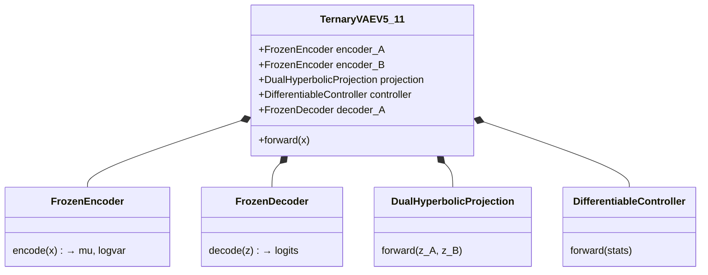

# Ternary VAE Bioinformatics Documentation

> **Unified Documentation Hub - Single source of truth for the project.**

---

## Quick Start

| Resource                                   | Description                |
| :----------------------------------------- | :------------------------- |
| [QUICK_START.md](QUICK_START.md)           | 5-minute project overview  |
| [00_MASTER_INDEX.md](00_MASTER_INDEX.md)   | Complete documentation map |
| [NAVIGATION_GUIDE.md](NAVIGATION_GUIDE.md) | Find docs by role          |

---

## Documentation Structure

### 01 Project Knowledge Base

_The "Static" Truth. Immutable concepts, standards, and assets._

- **02_THEORY_AND_FOUNDATIONS/** - Mathematical and biological foundations
- **03_EXPERIMENTS_AND_LABS/** - Research notebooks and findings
- **04_SCIENTIFIC_HISTORY/** - Archive of discoveries
- **05_LEGAL_AND_IP/** - Licenses, IP protection

### 02 Project Management

_The "Active" Execution. Mutable plans, tasks, and health checks._

- **00_TASKS/** - Actionable P0/P1/P2/P3 items
- **01_ROADMAPS_AND_PLANS/** - Quarterly strategies
- **02_CODE_HEALTH_METRICS/** - Auditing and technical debt
- **03_ARCHIVE/** - Deprecated plans

### 03 Presentation Tiers

_Tailored packages for specific stakeholders._

- **[01_TIER_1_PUBLIC/](03_PRESENTATION_TIERS/01_TIER_1_PUBLIC/)** - Scientists, clinicians, media
- **[02_TIER_2_INVESTOR/](03_PRESENTATION_TIERS/02_TIER_2_INVESTOR/)** - VCs, grants, partners
- **[03_TIER_3_TECHNICAL/](03_PRESENTATION_TIERS/03_TIER_3_TECHNICAL/)** - Due diligence, deep technical

### 05 Validation

_Test strategies and verification frameworks._

### 06 Diagrams

_100+ Mermaid diagrams for architecture and workflows._

---

## Architecture Overview

---

## Content Standards

All documentation follows [CONTENT_STANDARDS.md](STANDARDS/CONTENT_STANDARDS.md).

Templates available in [STANDARDS/TEMPLATES/](STANDARDS/TEMPLATES/).

---

## External Documentation

See [EXTERNAL_DOCS_INDEX.md](EXTERNAL_DOCS_INDEX.md) for docs outside this folder.

---

_Last updated: 2025-12-24_
