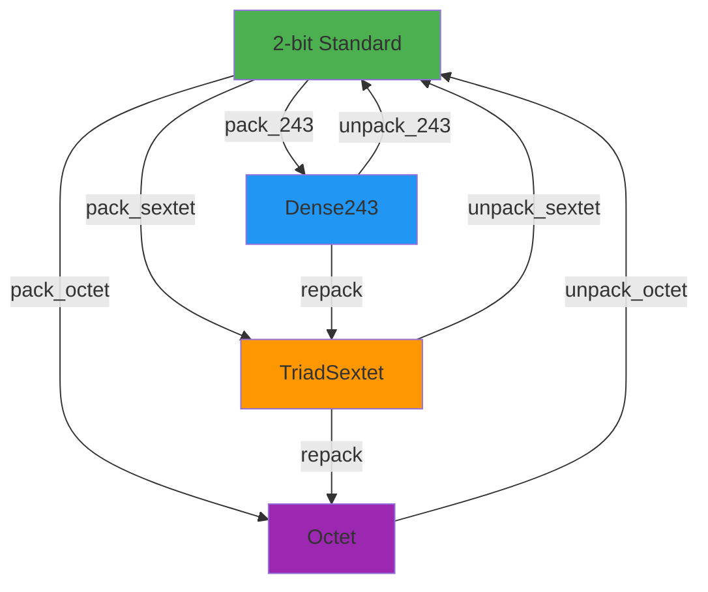

# Hexatic Automaton Integration Framework
## Category-Theoretic Unified Architecture for Ternary Computing

**Doc-Type:** Research Analysis & Architecture Proposal  
**Version:** 1.0  
**Author:** Gestalt + Antigravity AI  
**Date:** 2025-11-25  
**Status:** CONCEPTUAL - Pending Review

---

## Executive Summary

This document proposes a **disruptive reformulation** of the ternary-engine architecture using advanced mathematical abstractions from category theory, finite group theory, and cellular automata. The goal is to transcend the current dual-architecture tension (cold-path vs semantic-geometry) by recognizing the underlying **algebraic universals** and creating a **self-modifying, hexatic automaton-based meta-backend** that adaptively selects optimal computation strategies.

### Core Innovation

Reframe the ternary compute engine not as a collection of separate backends, but as:

1. **Finite Group Morphisms** — Operations form algebraic groups with well-defined homomorphisms
2. **Groupoid Structure** — Encodings (2-bit, Dense243, TriadSextet) are objects with invertible transformations
3. **Functorial Dispatch** — Backend selection as a functor mapping computational patterns to optimal execution paths
4. **Hexatic Cellular Automaton** — 6-state trit-based automaton encoding temporal computational carries through hardware cycles
5. **Self-Modifying Meta-Backend** — Runtime topology that rewrites its own dispatch logic based on observed invariants

---

## Part I: Mathematical Foundations

### 1.1 The Balanced Ternary Group

**Observation:** The set of trits $\mathcal{T} = \{-1, 0, +1\}$ under `tmul` forms a **cyclic group** isomorphic to $\mathbb{Z}_3$:

| · | -1 | 0 | +1 |
|---|----|----|-----|
| **-1** | +1 | 0 | -1 |
| **0**  | 0  | 0 | 0  |
| **+1** | -1 | 0 | +1 |

**Properties:**
- **Identity:** 0 under `tadd`, +1 under `tmul`
- **Inverses:** Each element is its own inverse under `tnot`
- **Closure:** All operations produce elements in $\mathcal{T}$

**Key Insight:** The LUT-based operations (`TADD_LUT`, `TMUL_LUT`, etc.) are **group action representations** on the 2-bit encoding space.

### 1.2 Encoding Groupoid

**Definition:** Let $\mathcal{E}$ be the **encoding groupoid** with:
- **Objects:** `{2-bit, Dense243, TriadSextet, Octet, Sixtet, ...}`
- **Morphisms:** Bijective pack/unpack transformations
  - $\text{pack}_{243}: \text{2-bit}^5 \to \text{Dense243}$
  - $\text{unpack}_{243}: \text{Dense243} \to \text{2-bit}^5$
  - $\text{pack}_{sextet}: \text{2-bit}^6 \to \text{TriadSextet}$

**Composition:** $(unpack \circ pack)(x) = id_x$ (round-trip identity)

**Significance:**
- Each encoding is an **equivalence class** of trit representations
- Transformations preserve semantic meaning (functorial property)
- Different encodings optimize for different cost metrics (space vs compute)

### 1.3 Backend Dispatch as a Functor

**Category of Computational Patterns** $\mathcal{C}$:
- **Objects:** Input characteristics (entropy, size, correlation, cache state)
- **Morphisms:** Transformations that preserve performance characteristics

**Category of Execution Strategies** $\mathcal{E}$:
- **Objects:** Backends (Scalar, AVX2_v1, AVX2_v2, Fusion, Dense243)
- **Morphisms:** Backend capability relationships (AVX2_v2 extends AVX2_v1)

**Dispatch Functor** $F: \mathcal{C} \to \mathcal{E}$:
```
F(low_entropy) → AVX2_v2_canonical (geometric optimization)
F(high_entropy) → AVX2_v1_cold_path (direct kernels)
F(micro_arrays) → Scalar (overhead avoidance)
F(mega_arrays) → AVX2 + OpenMP + Fusion
```

**Natural Transformation:** The adaptive selector $\eta: F \Rightarrow G$ allows runtime switching between functorial strategies.

---

## Part II: The Hexatic Automaton Architecture

### 2.1 From 3-State to 6-State: Hexatic Extension

**Current System:** 2-bit encoding uses 3/4 states (00, 01, 10; 11 unused)

**Hexatic Proposal:** Utilize the unused `0b11` state to create a **6-state cellular automaton**:

| State | Semantic | Encoding |
|-------|----------|----------|
| **S₀** | Trit -1 | `0b00` |
| **S₁** | Trit 0  | `0b01` |
| **S₂** | Trit +1 | `0b10` |
| **S₃** | Carry +  | `0b11_00` (temporal tag)|
| **S₄** | Carry -  | `0b11_01` (temporal tag)|
| **S₅** | Null/Reset | `0b11_10` (computational boundary) |

**Temporal Encoding:**
- States S₃, S₄, S₅ exist transiently during multi-clock-cycle operations
- Hardware pipeline stages encode intermediate computational carries
- Deterministic state transitions through clock-synchronized automaton rules

### 2.2 Hexatic State Transition Rules

The automaton operates on a **lattice of trits** with local update rules:

```cpp
// Hexatic update rule (simplified)
uint8_t hexatic_transition(uint8_t cell, uint8_t neighbors[6]) {
    if (cell <= 0b10) {
        // Standard trit: check for saturation overflow
        int sum = compute_local_sum(cell, neighbors);
        if (sum > +1) return CARRY_PLUS;   // S₃
        if (sum < -1) return CARRY_MINUS;  // S₄
        return encode_trit(sum);           // S₀, S₁, S₂
    } else if (cell == CARRY_PLUS) {
        // Propagate carry to next clock cycle
        return resolve_carry(neighbors);
    }
    // ... (full state machine)
}
```

**Key Innovation:** The hexatic automaton **self-organizes** computational carries through spatial-temporal patterns, enabling:
- **Overflow detection** without conditional branching
- **Parallel carry propagation** via cellular rule evaluation
- **Fractal self-similarity** in recursive trit operations

### 2.3 Relationship to think.md Insights

The `think.md` analysis identified two architectural invariants:

**Invariant A (Cold Path):**
- Minimal branching, deterministic kernels
- Direct AVX2 operations
- **Hexatic Mapping:** Uses S₀-S₂ states only (pure trit computation)

**Invariant B (Semantic Geometry):**
- Canonical indexing, dual-shuffle
- Exploitation of trit correlation patterns
- **Hexatic Mapping:** Activates S₃-S₅ states for carry encoding and entropy collapse detection

**Unified Perspective:** The hexatic automaton **subsumes both invariants** as different operational modes of the same underlying state machine.

---

## Part III: Self-Modifying Meta-Backend

### 3.1 Concept: Computational Reflection

A **self-modifying automaton** is one that can:
1. **Observe** its own execution patterns (via profiling)
2. **Learn** invariant structures (clustering, geometric collapses)
3. **Rewrite** dispatch tables dynamically

**Implementation Strategy:**

```cpp
class HexaticMetaBackend {
    // Runtime topology graph
    std::map<PatternSignature, BackendStrategy> dispatch_table;
    
    // Observation layer
    void observe_execution(const ComputeTrace& trace) {
        auto signature = extract_invariants(trace);
        auto current_backend = get_active_backend();
        auto performance = measure_metrics(trace);
        
        // Update internal model
        update_dispatch_table(signature, current_backend, performance);
    }
    
    // Self-modification layer
    void optimize_topology() {
        // Cluster similar patterns
        auto clusters = dbscan(dispatch_table);
        
        // Generate specialized fusion kernels
        for (auto& cluster : clusters) {
            if (cluster.frequency > threshold) {
                auto fused_kernel = JIT_compile_fusion(cluster.pattern);
                register_backend(cluster.id, fused_kernel);
            }
        }
    }
    
    // Dispatch with learning
    Result execute(const Tensor& input) {
        auto signature = compute_signature(input);
        auto backend = select_backend(signature);  // Functorial dispatch
        auto result = backend->execute(input);
        observe_execution(create_trace(input, result, backend));
        return result;
    }
};
```

### 3.2 Markov Predictor for Geometric Collapses

From `think.md`: "implicit Markov-like patterns (fractal feedback per cycle)"

**Proposal:** Integrate a **hidden Markov model (HMM)** to predict when semantic geometry optimizations will yield anomalous gains:

- **States:** `{random, low_correlation, fractal, dense243_compatible}`
- **Observations:** Entropy metrics, inter-trit correlation, repetition patterns
- **Transitions:** Learned from execution traces

**Usage:**
```cpp
if (markov_predictor.predict_state(input) == FRACTAL) {
    return GeometricBackend();  // Canonical + dual-shuffle
} else {
    return ColdPathBackend();    // Direct AVX2
}
```

### 3.3 JIT Fusion Kernel Generation

When the meta-backend detects **recurring patterns**, it can:
1. Extract the operation sequence
2. Generate an LLVM IR fusion kernel
3. Compile to machine code
4. Register as a new backend specialization

**Example:**
```
Pattern detected: [tnot → tadd → tmul] (frequency: 10,000x)
→ Generate: fused_tnot_tadd_tmul_avx2()
→ Benchmark: 2.3× faster than sequential
→ Register in dispatch table
```

---

## Part IV: Groupoid Homomorphisms and Encoding Transforms

### 4.1 The Encoding Transformation Lattice



**Functorial Property:** All paths preserve semantic equivalence
- $(unpack \circ pack)(x) \equiv x$
- Operations commute across encodings: $\text{op}_{enc1}(\text{pack}(x)) = \text{pack}(\text{op}_{enc0}(x))$

### 4.2 Canonical Indexing as a Group Homomorphism

**Traditional indexing:** $\phi_{trad}(a, b) = (a \ll 2) | b$  
**Canonical indexing:** $\phi_{canon}(a, b) = 3a + b$

**Observation:** Both are **bijections** on the valid trit pair space, but $\phi_{canon}$ preserves base-3 structure!

**Group Homomorphism Property:**
```
φ_canon: (ℤ₃ × ℤ₃, +) → (ℤ₉, +)
φ_canon((a₁, b₁) + (a₂, b₂)) = φ_canon(a₁, b₁) + φ_canon(a₂, b₂) (mod 9)
```

This explains why canonical indexing enables geometric optimizations: it **preserves the additive structure** of the trit space!

---

## Part V: Implementation Roadmap

### 5.1 Phase A: Hexatic State Machine Prototype

**Goal:** Implement 6-state cellular automaton for overflow/carry encoding

**Components:**
1. Extend trit encoding to include `0b11` states with temporal tags
2. Define hexatic transition rules (local update functions)
3. Create SIMD kernels for cellular rule evaluation (AVX2 parallel updates)
4. Benchmark against current saturation-based overflow handling

**Validation:**
- All 243 truth table states preserved
- Correctness via extensive property testing
- Performance comparison: hexatic carry vs conditional saturation

### 5.2 Phase B: Meta-Backend Infrastructure

**Goal:** Build self-modifying dispatch system

**Components:**
1. Pattern signature extraction (entropy, correlation, cache metrics)
2. Execution trace collection and storage
3. DBSCAN clustering for pattern families
4. Dynamic dispatch table updates

**Validation:**
- Benchmark suite with diverse workloads
- Compare static dispatch vs adaptive dispatch
- Measure overhead of observation layer

### 5.3 Phase C: Functorial Backend Unification

**Goal:** Reformulate all backends as functorial transformations

**Components:**
1. Define category of computational patterns formally
2. Implement functor $F: \mathcal{C} \to \mathcal{E}$ with explicit mapping rules
3. Create natural transformation $\eta$ for backend morphisms
4. Validate categorical laws (functor composition, identity preservation)

**Validation:**
- Formal verification of functorial properties
- Property-based testing (QuickCheck-style)

### 5.4 Phase D: JIT Fusion Kernel Compiler

**Goal:** Generate specialized fusion kernels at runtime

**Components:**
1. LLVM IR generation from operation sequences
2. JIT compilation pipeline
3. Performance profiling and regression testing
4. Kernel cache and lifetime management

**Validation:**
- Compare JIT-generated vs hand-written kernels
- Measure compilation overhead vs runtime savings

### 5.5 Phase E: Markov Predictor Integration

**Goal:** Predict optimal backend using HMM

**Components:**
1. Feature extraction from input tensors
2. HMM training on benchmark traces
3. Online prediction during dispatch
4. Accuracy metrics and A/B testing

**Validation:**
- Prediction accuracy vs ground truth (oracle backend selection)
- Performance impact of prediction overhead

---

## Part VI: Theoretical Implications

### 6.1 Ternary Logic as a Topos

**Conjecture:** The ternary computation system forms a **topos** (category with terminal object, pullbacks, exponentials):

- **Terminal Object:** The zero tensor `0ₜ`
- **Products:** Tuple formation `(a, b)` with projections
- **Exponentials:** Operation currying `curry(tadd)(a)(b) = tadd(a, b)`
- **Subobject Classifier:** Truth values $\Omega = \mathcal{T}$ with characteristic functions

**Implication:** If proven, enables higher-order type theory and dependent types for ternary computing.

### 6.2 Dense243 and the Yoneda Lemma

**Observation:** Dense243 encoding defines a **presheaf** on the category of trit-tuples:

```
Dense243: C^op → Set
Dense243(n) = {packed byte representations of n trits}
```

**Yoneda Embedding:**
The pack/unpack isomorphism can be understood via the Yoneda lemma:
```
Nat(Hom(−, 2-bit), Dense243) ≅ Dense243(2-bit)
```

**Practical Impact:** Systematic derivation of optimal packing strategies from categorical universals.

### 6.3 Hexatic Automaton and Quantum Analogy

**Speculative Connection:**

The 6-state hexatic automaton with temporal carries resembles **quantum superposition**:
- States S₀-S₂: Classical trit states ("collapsed")
- States S₃-S₅: Intermediate "carry" states ("superposed")
- Clock cycle: "Measurement" that collapses carries to definite trits

**Research Direction:** Explore if hexatic automaton can model **ternary quantum computing** primitives (qutrits).

---

## Part VII: Integration with Current Codebase

### 7.1 Minimal Disruption Strategy

**Principle:** Introduce hexatic system as a **new backend layer**, not a rewrite.

**Architecture:**
```
Current:
  Python Bindings → ternary_simd_engine → {Scalar, AVX2_v1, AVX2_v2, Fusion}

Proposed:
  Python Bindings → HexaticMetaBackend → {
      Classical Backends (Scalar, AVX2_v1, AVX2_v2),
      Hexatic Backends (HexaticAVX2, HexaticFusion),
      JIT-Fused Backends (Generated at runtime)
  }
```

**Migration Path:**
1. Implement `HexaticMetaBackend` as optional experimental backend
2. Add feature flag: `--enable-hexatic`
3. Benchmark exhaustively against existing backends
4. Gradual cutover if performance superior

### 7.2 Compatibility Layer

**Goal:** Ensure all existing code continues to work

**Implementation:**
- `HexaticMetaBackend::execute()` accepts same API as current backends
- Automatic fallback to classical backends if hexatic disabled
- Zero-copy compatibility with current NumPy bindings

### 7.3 Test Coverage

**New Tests Required:**
1. Hexatic state transition correctness (all 6×64 transitions)
2. Round-trip invariants (pack/unpack with hexatic states)
3. Meta-backend dispatch accuracy (oracle comparison)
4. JIT kernel functional equivalence
5. Performance regression suite

---

## Part VIII: Open Questions & Future Research

### 8.1 Unanswered Theoretical Questions

1. **Topos Structure Proof:** Does the ternary system actually form a topos? Formal proof needed.
2. **Optimal Hexatic Rules:** What is the minimal set of transition rules for maximal computational power?
3. **Functorial Completeness:** Can *all* backend selection strategies be represented as functors?
4. **Markov Convergence:** Does the HMM predictor converge to optimal selection with finite training?

### 8.2 Engineering Challenges

1. **JIT Overhead:** Can compilation overhead be amortized for real workloads?
2. **Cache Pollution:** Does observation layer metrics collection degrade performance?
3. **Hexatic State Explosion:** How to manage 6-state space without memory bloat?
4. **Concurrency:** Thread-safe self-modification of dispatch tables?

### 8.3 Hardware Acceleration

**Vision:** Custom silicon implementing hexatic automaton rules

**Potential Designs:**
- **FPGA Prototype:** Verilog implementation of 6-state cellular automaton
- **ASIC Path:** Gate-level design for hexatic evaluation units
- **GPU Kernel:** CUDA/ROCm implementation for massive parallelism

---

## Part IX: Conclusion & Recommendations

### 9.1 Summary of Contributions

This proposal introduces:

1. **Group-Theoretic Foundation:** Recognize ternary operations as algebraic groups/groupoids
2. **Functorial Dispatch:** Backend selection as category-theoretic functor morphisms
3. **Hexatic Automaton:** 6-state cellular automaton for overflow/carry encoding
4. **Self-Modifying Meta-Backend:** Runtime topology optimization via learning
5. **Unified Architecture:** Subsume cold-path vs semantic-geometry tension under single framework

### 9.2 Decision Points for User

**Questions for Gestalt:**

1. **Scope:** Prototype hexatic automaton first, or build full meta-backend?
2. **Risk Tolerance:** Acceptable performance overhead for self-modification (1%? 5%? 10%)?
3. **Timeline:** Experimental research project (6-12 months) vs production integration (2-4 weeks)?
4. **Validation:** Formal proofs required, or empirical benchmarks sufficient?

### 9.3 Recommended Next Steps

**Short-Term (1-2 weeks):**
1. Implement hexatic state machine as header-only library
2. Create proof-of-concept for 6-state SIMD kernels
3. Benchmark hexatic carry vs saturation-based overflow
4. Write up findings in `reports/HEXATIC_POC.md`

**Medium-Term (1-3 months):**
1. Build meta-backend prototype with static dispatch table
2. Integrate pattern signature extraction
3. Implement Markov predictor (sklearn HMM as baseline)
4. A/B test adaptive dispatch vs current system

**Long-Term (3-12 months):**
1. JIT fusion kernel compiler (LLVM backend)
2. Full self-modification infrastructure
3. Hardware prototyping (FPGA hexatic accelerator)
4. Academic publication on category-theoretic ternary computing

---

## Appendix A: Mathematical Notation Reference

| Symbol | Meaning |
|--------|---------|
| $\mathcal{T}$ | Set of trits {-1, 0, +1} |
| $\mathcal{E}$ | Encoding groupoid |
| $\mathcal{C}$ | Category of computational patterns |
| $\mathcal{E}$ | Category of execution strategies |
| $F: \mathcal{C} \to \mathcal{E}$ | Dispatch functor |
| $\eta: F \Rightarrow G$ | Natural transformation (adaptive selector) |
| $\phi_{canon}$ | Canonical indexing homomorphism |
| $\text{pack}_{243}$ | Dense243 packing morphism |
| $S_i$ | Hexatic automaton state (i ∈ {0,1,2,3,4,5}) |

---

## Appendix B: Code Sketch - Hexatic Prototype

```cpp
// hexatic_core.h - 6-State Cellular Automaton Prototype

#ifndef HEXATIC_CORE_H
#define HEXATIC_CORE_H

#include <stdint.h>
#include <immintrin.h>

// Hexatic state encoding (2 bits + temporal tag)
enum HexaticState : uint8_t {
    TRIT_MINUS  = 0b00,      // S₀: -1
    TRIT_ZERO   = 0b01,      // S₁:  0
    TRIT_PLUS   = 0b10,      // S₂: +1
    CARRY_PLUS  = 0b11_00,   // S₃: Overflow +
    CARRY_MINUS = 0b11_01,   // S₄: Overflow -
    NULL_RESET  = 0b11_10    // S₅: Computational boundary
};

// Hexatic transition function (single cell)
uint8_t hexatic_transition(uint8_t state, uint8_t neighbors[6]) {
    if (state <= TRIT_PLUS) {
        // Standard trit: check for saturation
        int local_sum = compute_weighted_sum(state, neighbors);
        if (local_sum > 1) return CARRY_PLUS;
        if (local_sum < -1) return CARRY_MINUS;
        return encode_trit(local_sum);
    } else {
        // Carry state: propagate or resolve
        return resolve_carry(state, neighbors);
    }
}

// AVX2 parallel hexatic evaluation (32 cells)
__m256i hexatic_transition_avx2(__m256i states, __m256i neighbors[6]) {
    // Mask standard trits vs carry states
    __m256i trit_mask = _mm256_cmpgt_epi8(_mm256_set1_epi8(0b11), states);
    
    // Parallel sum for standard trits
    __m256i local_sums = compute_local_sums_simd(states, neighbors);
    __m256i overflow_plus = _mm256_cmpgt_epi8(local_sums, _mm256_set1_epi8(1));
    __m256i overflow_minus = _mm256_cmpgt_epi8(_mm256_set1_epi8(-1), local_sums);
    
    // Blend: standard trits vs overflow detection
    __m256i result_trits = _mm256_blendv_epi8(
        encode_trit_simd(local_sums),
        _mm256_set1_epi8(CARRY_PLUS),
        overflow_plus
    );
    
    // Handle carry states separately
    __m256i result_carries = resolve_carries_simd(states, neighbors);
    
    return _mm256_blendv_epi8(result_carries, result_trits, trit_mask);
}

#endif // HEXATIC_CORE_H
```

---

**END OF DOCUMENT**

**Next Action:** Await user feedback on:
1. Theoretical direction (focus on formal proofs vs empirical prototypes)
2. Implementation priorities (hexatic automaton vs meta-backend vs JIT fusion)
3. Integration strategy (experimental branch vs production merge)
4. Timeline and resource constraints
