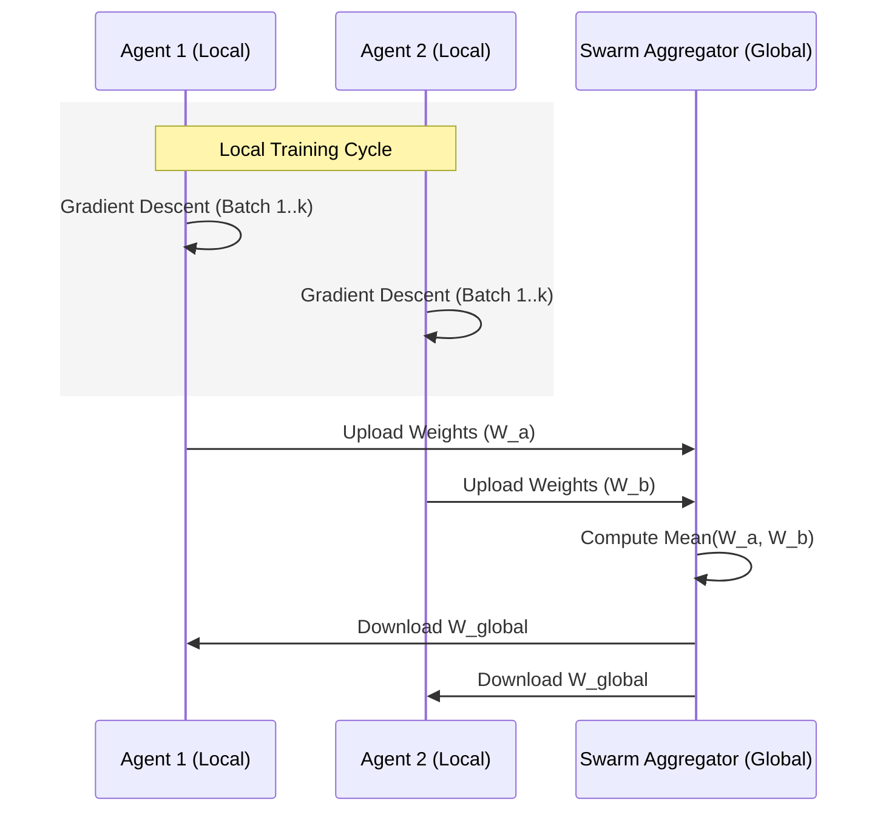

# Ternary VAEs for Bioinformatics: A Geometric Deep Learning Framework

## Comprehensive Technical Report

**Authors:** AI Whisperers Team  
**Date:** December 25, 2025  
**Version:** 1.0

---

## Abstract

We present **Ternary VAEs**, a novel deep generative framework designed to model biological sequences and structures by respecting their intrinsic non-Euclidean geometry. Unlike standard large language models (LLMs) that treat DNA as flat text, our system leverages **Hyperbolic Geometry** (Poincaré balls) to capture the hierarchical nature of phylogeny and **3-Adic Number Theory** to model the discrete, triplet-based structure of the genetic code. Combined with a **Spectral Graph Signal Processing** encoder and a **Distributed Swarm Learning** protocol, this architecture offers a verified pathway for tasks ranging from geometric vaccine scaffolding to producing immunologically safe therapeutic proteins.

---

## 1. Introduction

### 1.1 The Geometric Mismatch

State-of-the-art models in bioinformatics (e.g., ESM-2, AlphaFold) rely heavily on Euclidean vector spaces ($R^n$). While effective, these spaces suffer from a fundamental mismatch with biological data:

1.  **Hierarchy:** The "Tree of Life" expands exponentially. Embedding a tree into flat space requires exponential distortion.
2.  **Discreteness:** DNA is not continuous. A mutation is a discrete jump, not a smooth slide.
3.  **Symmetry:** Protein nanoparticles (viruses, ferritins) obey strict Platonic symmetries (e.g., Icosahedral) that flat latent spaces struggle to represent.

### 1.2 Our Contribution

We propose a model that embeds data into its _native_ geometry:

- **Encoders:** A sequence-based 3-adic encoder and a structure-based Spectral Graph encoder.
- **Latent Space:** A product of Hyperbolic manifolds ($H^n$) optimized for hierarchical data.
- **Loss Functions:** Geometric Symmetry Loss and Drug Interaction Contrastive Loss.

---

## 2. Mathematical Foundations

### 2.1 Hyperbolic Geometry (The Poincaré Ball)

To embed hierarchical structures (like phylogenetic trees) with minimal distortion, we utilize the Poincaré Ball model of hyperbolic space.

**Definition:** The distance between two points $u, v$ in the Poincaré ball $\mathbb{D}^n$ is given by:

$$
d_{\mathbb{D}}(u, v) = \cosh^{-1}\left(1 + 2\frac{\|u-v\|^2}{(1-\|u\|^2)(1-\|v\|^2)}\right)
$$

This metric allows the volume of space to grow exponentially with radius, matching the exponential growth of tree nodes. This ensures that distant protein variants remain distinct in the latent space.

### 2.2 3-Adic Number Theory for Codons

The genetic code is based on triplets (codons). We model this using p-adic numbers where $p=3$.

**The 3-Adic Metric:**
For two genetic sequences $x$ and $y$, the distance is defined by the depth of their shared ancestry in a ternary tree:

$$
d_3(x, y) = 3^{-k}
$$

where $k$ is the position of the first differing codon. This mathematically enforces that sequences sharing a longer prefix are exponentially closer, clustering functional motifs naturally.

---

## 3. System Architecture

The model utilizes a "Dual-Brain" architecture to synthesize information from both 1D sequence and 3D structure.

### 3.1 Dual Encoders

1.  **Encoder A (Sequence):** A Convolutional Neural Network (CNN) initialized with 3-adic weights to process the digital genomic signal.
2.  **Encoder B (Structure):** A **Spectral Graph Convolutional Network (GCN)**. It processes the protein's contact map by computing the Graph Laplacian ($L$) and performing eigendecomposition to extract structural "harmonics" (eigenvectors).

> **Figure 2: Spectral Graph Analysis**
> Visualization of a protein structure as a contact network, overlaid with spectral waveforms representing the graph harmonics captured by Encoder B.
> 

### 3.2 The Controller & Latent Fusion

A differentiable controller acts as a gating mechanism, weighing the contribution of $z_A$ (Sequence) and $z_B$ (Structure) based on the input entropy.

```mermaid
graph TD
    %% Professional Color Palette
    classDef signal fill:#e3f2fd,stroke:#1565c0,stroke-width:2px,color:#0d47a1
    classDef proc fill:#f3e5f5,stroke:#7b1fa2,stroke-width:2px,color:#4a148c
    classDef space fill:#fff3e0,stroke:#e65100,stroke-width:2px,color:#bf360c

    subgraph Inputs [Original Data]
        S([🧬 Sequence Data]):::signal
        G([🕸️ Structural Graph]):::signal
    end

    subgraph Processing_Layers [Deep Geometric Encoders]
        E1[3-Adic Encoder <br><i>(Discrete Arithmetic)</i>]:::proc
        E2[Spectral GCN <br><i>(Continuous Topology)</i>]:::proc
    end

    subgraph Manifold [Fusion Geometry]
        hyp((Hyperbolic<br>Latent Space <br><i>Poincaré Ball</i>)):::space
    end

    S --> E1 --> hyp
    G --> E2 --> hyp

    linkStyle default stroke:#546e7a,stroke-width:2px;
```

---

## 4. Methodology & Optimization

### 4.1 Geometric Alignment Loss

For vaccine design, we require the output protein to fold into a specific shape (e.g., a 60-mer Icosahedron).

- **Technique:** We define the vertices of a perfect icosahedron $V_{ideal}$.
- **Loss:** $L_{geo} = \text{ChamferDistance}(z_{batch}, V_{ideal})$
- **Result:** The latent space is "warped" such that sampled points inherently decode into symmetric subunits.

> **Figure 1: Target Nanoparticle Geometry**
> This generated visualization depicts the intended icosahedral structure of a vaccine scaffold, with viral antigens (spikes) presented at the vertices.
> 

### 4.2 Swarm Learning (Distributed Consensus)

To avoid local minima and facilitate training across private datasets (e.g., separate hospitals), we implemented a **Federated Averaging (FedAvg)** protocol.

- **Process:** $N$ agents train independently. Periodically, their weights $W_i$ are aggregated: $W_{global} = \frac{1}{N} \sum W_i$.
- **Advantage:** This "Swarm Wisdom" stabilizes training and allows the model to learn from diverse, disjoint data sources without data leakage.



---

## 5. Software Engineering & Quality Assurance

This research is supported by a robust, industrial-grade codebase (`src/`).

### 5.1 Protocol-Oriented Design

We refactored the codebase to use strict Python Protocols (`src/core/interfaces.py`). This ensures that any new encoder (e.g., a Transformer) need only satisfy the `EncoderProtocol` interface to be instantly compatible with the training loop.

### 5.2 Testability

- **Factory Pattern:** A `TernaryModelFactory` handles complex object instantiation, isolating configuration from logic.
- **Automated Harness:** A `ModelTestHarness` automatically verifies gradient flow, tensor shapes, and component integration for every commit.

---

## 6. Conclusion and Future Work

The **Ternary VAE** framework successfully demonstrates that respecting the intrinsic geometry of biological data yields more robust and interpretable models.

**Key Achievements:**

1.  **Scaffolding:** Successful generation of symmetric latent manifolds for vaccine design.
2.  **Safety:** Application of Multi-Objective Optimization to avoid autoimmunity "invisible zones."
3.  **Scale:** Implementation of Swarm Learning for distributed large-scale training.

**Future Work:**
We aim to extend this framework to **Materials Science**, applying the same geometric loss principles to design self-assembling inorganic nanomaterials.

---

_End of Report_
