# Ternary VAEs: The Complete Project

## Merging Geometry, Biology, and Software Engineering

> **Vision:** To create a generative AI system that respects the fundamental geometry of nature—hierarchical, discrete, and distributed—backed by a robust, industrial-grade software architecture.

---

## 1. Theoretical Pillars: Redefining Biological AI

Standard AI treats biology like text. We treat it like geometry.

### A. The Geometry of Life (Hyperbolic Space)

Biological data—from phylogenetic trees to protein folding—is inherently hierarchical.

- **The Problem:** Embedding a branching tree into flat Euclidean space crushes the branches together, losing critical structural information.
- **Our Solution:** **Hyperbolic Geometry (Poincaré Ball)**.
  - Space expands exponentially from the center.
  - Perfectly accommodates exponentially growing trees.
  - Distances represent evolutionary time or structural divergence accurately.

### B. The Arithmetic of the Code (3-Adic Numbers)

The genetic code is discrete and triplet-based.

- **The Problem:** Continuous numbers (0.1, 0.2) obscure the discrete mutations of DNA.
- **Our Solution:** **3-Adic Number Theory**.
  - A number system where distance is measured by divisibility by 3 (matching codon triplets).
  - Cluster sequences that share deep ancestral roots, not just superficial similarity.

---

## 2. Engineering Architecture: Built for Scale

This project is not just a research script; it is a mature software system designed for extensibility and testing.

### A. Modular Design & Abstraction

We transitioned from monolithic scripts to a **Protocol-Oriented Architecture**.

- **Interfaces:** `EncoderProtocol`, `DecoderProtocol`, `ProjectionProtocol` define strict contracts.
- **Dependency Injection:** Components are injected into the model, allowing for easy swapping of parts (e.g., swapping a CNN encoder for a Transformer).
- **Factories:** `TernaryModelFactory` centralizes complex object creation, decoupling configuration from logic.

```mermaid
graph TD
    %% Styles
    classDef input fill:#e1f5fe,stroke:#01579b,stroke-width:2px,color:#000
    classDef brain fill:#f3e5f5,stroke:#4a148c,stroke-width:2px,color:#000
    classDef latent fill:#fff3e0,stroke:#e65100,stroke-width:2px,color:#000
    classDef output fill:#e8f5e9,stroke:#1b5e20,stroke-width:2px,color:#000

    subgraph Inputs [Input Data Modalities]
        direction TB
        Seq([🧬 Viral Sequence <br><i>1D Digital Code</i>]):::input
        Struc([🕸️ Protein Graph <br><i>3D Topology</i>]):::input
    end

    subgraph Encoders [Dual-Brain Encoders]
        direction TB
        EncA[[Encoder A: <br>3-Adic CNN]]:::brain
        EncB[[Encoder B: <br>Spectral GCN]]:::brain
    end

    subgraph Latent [Hyperbolic Latent Space]
        direction TB
        Z_A((z_A: Sequence <br><i>Poincaré Ball</i>)):::latent
        Z_B((z_B: Structure <br><i>Poincaré Ball</i>)):::latent
        Control{Controller <br><i>Differentiable Fusion</i>}:::latent
    end

    subgraph Outputs [Generative Output]
        Dec[Decoder / Generator]:::output
        Out[✨ Reconstructed Protein]:::output
        Metric[📉 Geometric Loss]:::output
    end

    Seq --> EncA
    Struc --> EncB
    EncA --> Z_A
    EncB --> Z_B
    Z_A --> Control
    Z_B --> Control
    Control -->|Weighted Signal| Dec
    Dec --> Out
    Out -.-> Metric
```

### B. Robust Testing Infrastructure

We built a sophisticated testing harness to ensure reliability.

- **ModelTestHarness:** Standardized verification of shapes, gradients, and initialization.
- **Mocking:** Ability to inject mock encoders to test the Controller logic in isolation.
- **Automated Verification:** Git hooks (e.g., `pre-commit`) and CI pipelines ensure code quality (e.g., preventing `nul` file corruption).

---

## 3. Advanced Methodology

### A. Dual-Brain Architecture

Two encoders working in tandem:

1.  **Sequence Brain (3-Adic):** Reads the detailed digital code (AGTC).
2.  **Structure Brain (Spectral):** Reads the 3D topology via Graph Laplacians.
3.  **Controller:** A differentiable mechanism that balances these inputs like a DJ mixing tracks.

### B. Swarm Learning (Distributed AI)

A general framework for distributed intelligence.

- **SwarmTrainer:** Implements Federated Averaging (FedAvg).
- **Benefit:** Multiple agents can explore different parts of the loss landscape (or different private datasets) and converge on a superior global consensus.

```mermaid
sequenceDiagram
    autonumber
    participant A as 🏥 Agent 1 (Hospital A)
    participant B as 🔬 Agent 2 (Research Lab)
    participant C as 🏭 Agent 3 (Pharma Co.)
    participant S as 🧠 Swarm Consensus (Cloud)

    Note over A,C: 🔒 Phase 1: Private Local Training
    rect rgb(240, 248, 255)
    A->>A: Train VAE on Patient Data
    B->>B: Train VAE on Experimental Data
    C->>C: Train VAE on Proprietary Data
    end

    Note over A,S: ☁️ Phase 2: Knowledge Aggregation
    rect rgb(255, 250, 240)
    A->>S: Upload Encrypted Weights
    B->>S: Upload Encrypted Weights
    C->>S: Upload Encrypted Weights

    activate S
    S->>S: 🔄 FedAvg (Consensus Algorithm)
    Note right of S: "Wisdom of Crowds" <br> Integration
    S->>A: Distribute Improved Model
    S->>B: Distribute Improved Model
    S->>C: Distribute Improved Model
    deactivate S
    end

    Note over A,C: 🚀 Phase 3: Enhanced Local Inference
    A->>A: Predict with Global Knowledge
```

---

## 4. Applications and Results

### A. Geometric Vaccine Design

- **Concept:** Force the latent space to adopt the symmetry of a Platonic solid.
- **Result:** Protein scaffolds that self-assemble into icosahedral nanoparticles, creating highly effective vaccines.

### B. General Generative Modeling

- **Multi-Objective Optimization:** We don't just generate "valid" proteins; we optimize for specific properties.
  - **The "Invisible Zone":** Minimizing autoimmune risk while maximizing stability.
  - **Drug Interaction:** Controlling the binding affinity to specific therapeutic targets.

---

## 5. Future Directions

- **Materials Science:** Using the Geometric Loss to design self-assembling non-biological nanomaterials.
- **production Deployment:** The new Factory/Interface architecture allows for immediate deployment to cloud inference endpoints.
- **General Swarm Intelligence:** Applying the `SwarmTrainer` to other domains beyond biology, such as distributed financial modeling or sensor networks.

