# Architecture

The Ternary VAE system is built on a modular architecture combining hyperbolic geometry with p-adic number theory for biological sequence analysis.

## System Overview

```mermaid
flowchart LR
    subgraph TernaryVAE["TernaryVAE V5.11"]
        direction LR

        subgraph Enc["Encoder"]
            E1["MLP/GVP"] --> E2["μ, σ<br/>(Euclidean)"]
        end

        subgraph Lat["Latent Space"]
            L1["exp_map_zero()"] --> L2["Poincaré Ball"]
        end

        subgraph Dec["Decoder"]
            D1["MLP"] --> D2["Softmax<br/>(19,683)"]
        end

        Enc --> Lat --> Dec
    end

    Input[/"One-Hot<br/>(B, 19683)"/] --> TernaryVAE
    TernaryVAE --> Output[/"Reconstruction<br/>(B, 19683)"/]

    style Enc fill:#fff3e0
    style Lat fill:#f3e5f5
    style Dec fill:#e8f5e9
```



## Core Components

### 1. Models (`src/models/`)

| Class | Description |
|-------|-------------|
| `TernaryVAE` | Main VAE with hyperbolic latent space (V5.11) |
| `TernaryVAE_OptionC` | Alternative architecture with shared parameters |
| `SwarmVAE` | Multi-agent swarm-based VAE |
| `HyperbolicProjection` | Projects Euclidean to Poincare ball |
| `HomeostasisController` | Stability controller for training |

### 2. Geometry (`src/geometry/`)

| Component | Description |
|-----------|-------------|
| `PoincareBall` | Manifold operations via geoopt |
| `exp_map_zero` | Exponential map from origin |
| `log_map_zero` | Logarithmic map to origin |
| `mobius_add` | Mobius addition in hyperbolic space |
| `RiemannianAdam` | Optimizer for manifold parameters |
| `HolographicPoincareManifold` | AdS/CFT-inspired extensions |

### 3. Loss Functions (`src/losses/`)

| Component | Description |
|-----------|-------------|
| `LossRegistry` | Dynamic loss composition |
| `ReconstructionLoss` | Cross-entropy for ternary output |
| `KLDivergenceLoss` | Hyperbolic KL with free bits |
| `PAdicRankingLoss` | 3-adic valuation ranking |
| `RadialStratificationLoss` | Hierarchical structure |
| `CoEvolutionLoss` | Biosynthetic coherence |

### 4. Configuration (`src/config/`)

| Component | Description |
|-----------|-------------|
| `TrainingConfig` | Main configuration dataclass |
| `GeometryConfig` | Curvature, radius, dimension |
| `LossWeights` | Loss component weights |
| `load_config` | YAML + env var loader |

### 5. Training (`src/training/`)

| Component | Description |
|-----------|-------------|
| `TrainingLoop` | Main training orchestrator |
| `CallbackList` | Callback management |
| `EarlyStoppingCallback` | Patience-based stopping |
| `CheckpointCallback` | Model saving |

## Data Flow

### Forward Pass

1. **Input**: One-hot encoded ternary operations (19,683 dimensions)
2. **Encoder**: MLP produces μ and log(σ) in Euclidean space
3. **Reparameterization**: Sample z = μ + σ * ε
4. **Projection**: `exp_map_zero(z)` projects to Poincare ball
5. **Decoder**: MLP from hyperbolic coords to reconstruction
6. **Output**: Softmax over 19,683 ternary operations

### Loss Computation

```python
loss_result = registry.compose(outputs, targets)
# Returns LossResult with:
# - total: weighted sum
# - components: {"reconstruction": ..., "kl": ..., ...}
# - metrics: {"accuracy": ..., "coverage": ...}
```

## Module Dependencies

```mermaid
flowchart BT
    config["📁 config<br/>(No dependencies)"]
    geometry["📁 geometry"]
    losses["📁 losses"]
    models["📁 models"]
    training["📁 training"]
    encoders["📁 encoders"]
    diseases["📁 diseases"]
    observability["📁 observability"]

    config --> geometry
    config --> losses
    config --> observability
    geometry --> losses
    geometry --> encoders
    config --> models
    geometry --> models
    losses --> models
    config --> training
    models --> training
    losses --> training
    models --> diseases
    losses --> diseases

    style config fill:#c8e6c9
    style geometry fill:#bbdefb
    style losses fill:#ffe0b2
    style models fill:#e1bee7
    style training fill:#fff9c4
```



## Design Principles

1. **Separation of Concerns**: Models, losses, and training are independent
2. **Registry Pattern**: Dynamic loss composition without subclassing
3. **Dataclass Configs**: Type-safe, validated configuration
4. **Manifold-Aware**: All operations respect hyperbolic geometry
5. **Numerical Stability**: Epsilon guards, gradient clipping, homeostasis

## See Also

- [[Models]] - Detailed model documentation
- [[Geometry]] - Hyperbolic operations
- [[Loss Functions]] - Loss system architecture
- [[Configuration]] - Config system details
