```mermaid
flowchart TB
    subgraph Input["Input Layer"]
        A[/"Biological Sequences<br/>(Codons, Proteins, DNA)"/]
    end

    subgraph Encoder["Ternary Encoder"]
        B[MLP Layers] --> C[μ, σ in Euclidean]
        C --> D[Reparameterization<br/>z = μ + σε]
    end

    subgraph Latent["Hyperbolic Latent Space"]
        E["exp_map_zero()"] --> F[("Poincaré Ball<br/>‖z‖ < 1")]
    end

    subgraph Decoder["Ternary Decoder"]
        G[MLP Layers] --> H[/"Softmax(19,683)"/]
    end

    A --> B
    D --> E
    F --> G

    style Input fill:#e1f5fe
    style Encoder fill:#fff3e0
    style Latent fill:#f3e5f5
    style Decoder fill:#e8f5e9
```

```mermaid
flowchart TB
    subgraph PoincareBall["Poincaré Ball (‖x‖ < 1)"]
        direction TB

        Center["🔵 Center<br/>(Origin = Ancestors)"]

        Mid1["🟢"] & Mid2["🟢"] & Mid3["🟢"]

        Leaf1["🟡"] & Leaf2["🟡"] & Leaf3["🟡"] & Leaf4["🟡"]

        Center --- Mid1
        Center --- Mid2
        Center --- Mid3
        Mid1 --- Leaf1
        Mid1 --- Leaf2
        Mid2 --- Leaf3
        Mid3 --- Leaf4
    end

    Note1[/"Distance from center = Evolutionary divergence"/]
    Note2[/"Boundary = Most derived/specialized states"/]

    PoincareBall ~~~ Note1
    PoincareBall ~~~ Note2

    style Center fill:#2196f3,color:#fff
    style Mid1 fill:#4caf50,color:#fff
    style Mid2 fill:#4caf50,color:#fff
    style Mid3 fill:#4caf50,color:#fff
    style Leaf1 fill:#ffeb3b
    style Leaf2 fill:#ffeb3b
    style Leaf3 fill:#ffeb3b
    style Leaf4 fill:#ffeb3b
```

```mermaid
flowchart LR
    subgraph Forward["Forward Pass"]
        direction LR
        I["One-Hot Input<br/>(B, 19683)"] --> E1["Encoder<br/>MLP"]
        E1 --> MU["μ (B, D)"]
        E1 --> SIG["log σ (B, D)"]
        MU & SIG --> REP["Reparameterize<br/>z = μ + σ·ε"]
        REP --> EXP["exp_map_zero()"]
        EXP --> Z["z_hyperbolic<br/>(B, D)"]
        Z --> D1["Decoder<br/>MLP"]
        D1 --> O["Reconstruction<br/>(B, 19683)"]
    end

    style I fill:#bbdefb
    style Z fill:#e1bee7
    style O fill:#c8e6c9
```

```mermaid
flowchart BT
    config["📁 config<br/>(No dependencies)"]
    geometry["📁 geometry"]
    losses["📁 losses"]
    models["📁 models"]
    training["📁 training"]
    encoders["📁 encoders"]
    diseases["📁 diseases"]
    observability["📁 observability"]

    config --> geometry
    config --> losses
    config --> observability
    geometry --> losses
    geometry --> encoders
    config --> models
    geometry --> models
    losses --> models
    config --> training
    models --> training
    losses --> training
    models --> diseases
    losses --> diseases

    style config fill:#c8e6c9,stroke:#2e7d32
    style geometry fill:#bbdefb,stroke:#1565c0
    style losses fill:#ffe0b2,stroke:#ef6c00
    style models fill:#e1bee7,stroke:#7b1fa2
    style training fill:#fff9c4,stroke:#f9a825
```

```mermaid
flowchart TB
    Life["🌍 Life"]

    Life --> Bacteria["🦠 Bacteria"]
    Life --> Archaea["🔬 Archaea"]
    Life --> Eukarya["🧬 Eukarya"]

    Bacteria --> Ecoli["E. coli"]
    Bacteria --> Bacillus["Bacillus"]

    Eukarya --> Animals["🐾 Animals"]
    Eukarya --> Plants["🌱 Plants"]

    Animals --> Mammals["🐘 Mammals"]
    Animals --> Birds["🐦 Birds"]

    Mammals --> Primates["🐵 Primates"]
    Mammals --> Rodents["🐀 Rodents"]

    Primates --> Humans["👤 Humans"]

    style Life fill:#ffeb3b
    style Eukarya fill:#e1bee7
    style Animals fill:#bbdefb
    style Mammals fill:#b2dfdb
    style Primates fill:#c8e6c9
    style Humans fill:#81c784
```

```mermaid
flowchart TB
    subgraph Shield["Glycan Shield on Viral Surface"]
        direction TB

        AB["🔴 Antibody"]
        AB -->|"❌ Blocked"| G1

        subgraph Glycans["Sugar Molecules"]
            G1["🍭 Glycan"]
            G2["🍭 Glycan"]
            G3["🍭 Glycan"]
            G4["🍭 Glycan"]
        end

        subgraph Surface["═══ Viral Envelope ═══"]
            EP["🎯 Hidden Epitope"]
        end

        G1 & G2 & G3 & G4 --- Surface
    end

    note["Glycans block antibody access<br/>to conserved epitopes"]

    style AB fill:#ef5350,color:#fff
    style EP fill:#4caf50,color:#fff
    style Glycans fill:#fff9c4
    style Surface fill:#90a4ae
```

```mermaid
flowchart LR
    subgraph Tangent["Tangent Space T₀M (Euclidean)"]
        V1["v₁ (small)"]
        V2["v₂ (medium)"]
        V3["v₃ (large)"]
    end

    EXP["exp_map_zero()"]

    subgraph Ball["Poincaré Ball (Hyperbolic)"]
        P1["p₁ (near center)"]
        P2["p₂ (mid-radius)"]
        P3["p₃ (near boundary)"]
        Boundary(["‖x‖ = 1 (boundary at ∞)"])
    end

    V1 --> EXP
    V2 --> EXP
    V3 --> EXP

    EXP --> P1
    EXP --> P2
    EXP --> P3

    style Tangent fill:#e3f2fd
    style Ball fill:#fce4ec
    style Boundary fill:#ffcdd2,stroke-dasharray: 5 5
```

```mermaid
flowchart TB
    subgraph Registry["LossRegistry"]
        direction TB
        R["register()"]
        C["compose()"]
    end

    subgraph Components["Loss Components"]
        L1["ReconstructionLoss<br/>weight=1.0"]
        L2["KLDivergence<br/>weight=0.5"]
        L3["RankingLoss<br/>weight=0.1"]
        L4["RadialStratification<br/>weight=0.1"]
    end

    subgraph Outputs["Model Outputs"]
        O1["reconstruction"]
        O2["mu, logvar"]
        O3["z_hyperbolic"]
    end

    subgraph Result["LossResult"]
        Total["total = Σ(wᵢ × lossᵢ)"]
        Comp["components: {name: value}"]
        Met["metrics: {accuracy, coverage}"]
    end

    Components --> R
    Outputs --> C
    C --> Result

    style Registry fill:#e1bee7
    style Components fill:#fff3e0
    style Result fill:#c8e6c9
```

```mermaid
flowchart TB
    subgraph Swarm["SwarmVAE"]
        direction TB

        subgraph Agents["Agent Pool"]
            A1["🔍 Explorer<br/>(high variance)"]
            A2["⚡ Exploiter<br/>(low variance)"]
            A3["🎯 Scout<br/>(moderate)"]
            A4["🔍 Explorer"]
            A5["⚡ Exploiter"]
        end

        PH["📊 Pheromone Field<br/>(32×32 grid)"]

        A1 & A2 & A3 & A4 & A5 <--> PH
    end

    Input["Input (B, 19683)"] --> Swarm
    Swarm --> Output["Consensus z_hyperbolic"]

    style A1 fill:#bbdefb
    style A2 fill:#c8e6c9
    style A3 fill:#ffe0b2
    style A4 fill:#bbdefb
    style A5 fill:#c8e6c9
    style PH fill:#f3e5f5
```

# Diagram Improvements Guide

This document contains improved Mermaid diagrams to replace ASCII art in wiki pages.

---

## 1. Home.md - System Architecture

### Before (ASCII):
Hard to read nested boxes with box-drawing characters.

### After (Mermaid):



---

## 2. Home.md - Poincaré Ball Concept

### Before:
Confusing ASCII tree inside a text box.

### After (Mermaid):



---

## 3. Architecture.md - Data Flow

### Before:
Nested boxes with confusing arrows.

### After (Mermaid):



---

## 4. Architecture.md - Module Dependencies

### Before:
File tree with comments.

### After (Mermaid):



---

## 5. Architecture.md - Component Overview

### New (Mermaid):


---

## 6. Biological-Context.md - Phylogenetic Tree

### Before:
ASCII tree with alignment issues.

### After (Mermaid):



---

## 7. Biological-Context.md - Euclidean vs Hyperbolic Comparison

### Before:
Side-by-side ASCII trees.

### After (Mermaid):


---

## 8. Biological-Context.md - Glycan Shield

### Before:
Simplistic ASCII diagram.

### After (Mermaid):



---

## 9. Geometry.md - Exponential Map Visualization

### New (Mermaid):



---

## 10. Loss-Functions.md - Loss Registry Pattern

### New (Mermaid):



---

## 11. Models.md - SwarmVAE Architecture

### New (Mermaid):



---

## 12. Training.md - Training Pipeline

### New (Mermaid):


---

## 13. Evaluation.md - Metrics Overview

### New (Mermaid):


---

## Implementation Notes

### GitHub Wiki Mermaid Support

GitHub wikis support Mermaid diagrams natively. Simply wrap the code in:

````markdown

````

### Color Palette Used

| Color | Hex | Usage |
|-------|-----|-------|
| Blue | `#bbdefb`, `#e3f2fd` | Input/Data |
| Purple | `#e1bee7`, `#f3e5f5` | Latent Space |
| Green | `#c8e6c9`, `#e8f5e9` | Output/Results |
| Orange | `#fff3e0`, `#ffe0b2` | Processing |
| Yellow | `#fff9c4`, `#ffeb3b` | Highlights |

### Best Practices

1. **Use subgraphs** to group related concepts
2. **Add styling** for visual hierarchy
3. **Use emojis sparingly** for quick recognition
4. **Keep flowcharts top-to-bottom or left-to-right** for natural reading
5. **Add notes** for clarification
6. **Use class diagrams** for code structure
7. **Use mindmaps** for conceptual overviews

---

## Summary of Improvements

| Page | Original | Improved |
|------|----------|----------|
| Home.md | ASCII box diagram | Mermaid flowchart with subgraphs |
| Architecture.md | Nested ASCII boxes | Class diagram + dependency graph |
| Geometry.md | No diagrams | Added exp_map visualization |
| Biological-Context.md | ASCII trees | Styled Mermaid trees with emojis |
| Loss-Functions.md | No diagrams | Added registry pattern flow |
| Models.md | No diagrams | Added SwarmVAE architecture |
| Training.md | No diagrams | Added training pipeline flow |
| Evaluation.md | No diagrams | Added metrics mindmap |

