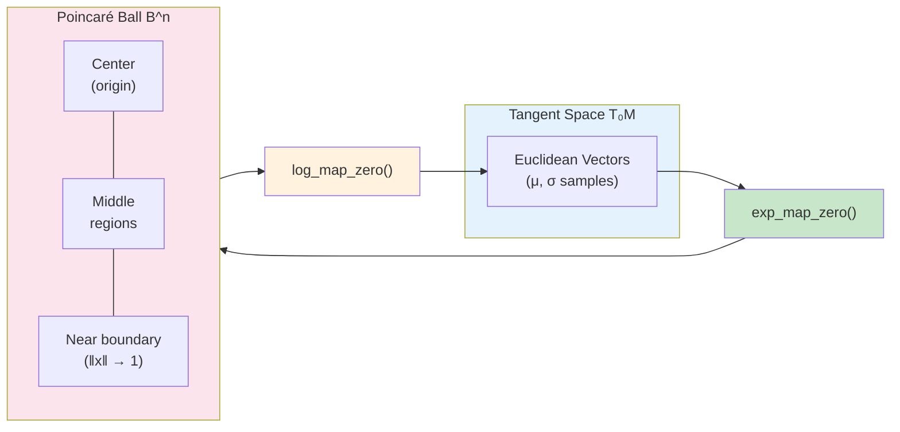

# Geometry

The Ternary VAE uses hyperbolic geometry (Poincare ball model) and p-adic number theory for representing biological sequences.

## Geometric Overview



## Hyperbolic Geometry Basics

### Why Hyperbolic Space?

Biological data often exhibits hierarchical structure:
- Phylogenetic trees
- Protein domain hierarchies
- Codon usage patterns

Hyperbolic space naturally embeds trees with low distortion, unlike Euclidean space.

### Poincare Ball Model

The Poincare ball is the open unit ball in R^n with the metric:

```
ds² = 4 / (1 - ||x||²)² * ||dx||²
```

Key properties:
- Points near the boundary represent "leaves" (far from origin)
- Points near the center represent "roots" (ancestors)
- Geodesics are circular arcs perpendicular to the boundary

## Core Operations

### Distance

```python
from src.geometry import poincare_distance

# Distance between two points
d = poincare_distance(x, y, curvature=1.0)

# Distance matrix
D = poincare_distance_matrix(X, Y, curvature=1.0)
```

Formula:
```
d(x, y) = (2/√κ) * arctanh(√κ * ||(-x) ⊕ y||)
```

### Exponential Map

Projects from tangent space at origin to manifold:

```python
from src.geometry import exp_map_zero

# Project Euclidean vector to Poincare ball
z_hyperbolic = exp_map_zero(z_euclidean, curvature=1.0)
```

Formula:
```
exp_0(v) = tanh(√κ * ||v|| / 2) * v / (√κ * ||v||)
```

### Logarithmic Map

Inverse of exponential map:

```python
from src.geometry import log_map_zero

# Project from Poincare ball to tangent space
z_euclidean = log_map_zero(z_hyperbolic, curvature=1.0)
```

### Mobius Addition

Addition operation in hyperbolic space:

```python
from src.geometry import mobius_add

# Hyperbolic addition
z = mobius_add(x, y, curvature=1.0)
```

Formula:
```
x ⊕ y = ((1 + 2κ⟨x,y⟩ + κ||y||²)x + (1 - κ||x||²)y) /
        (1 + 2κ⟨x,y⟩ + κ²||x||²||y||²)
```

### Parallel Transport

Transport vectors between tangent spaces:

```python
from src.geometry import parallel_transport

# Transport vector v from tangent space at x to tangent space at y
v_transported = parallel_transport(x, y, v, curvature=1.0)
```

## Projection to Ball

Ensure points stay inside the Poincare ball:

```python
from src.geometry import project_to_poincare

# Clip to max_radius
z_safe = project_to_poincare(z, max_radius=0.95, curvature=1.0)
```

## Riemannian Optimization

Standard optimizers don't work correctly on manifolds. Use Riemannian variants:

```python
from src.geometry import RiemannianAdam, get_riemannian_optimizer

# Option 1: Direct instantiation
optimizer = RiemannianAdam(model.parameters(), lr=0.001)

# Option 2: Factory function
optimizer = get_riemannian_optimizer(
    model.parameters(),
    optimizer_type="adam",
    lr=0.001,
    weight_decay=0.01,
)
```

## Manifold Parameters

For learnable points on the manifold:

```python
from src.geometry import ManifoldParameter, create_manifold_parameter

# Create a learnable point on the Poincare ball
point = create_manifold_parameter(
    initial_value=torch.zeros(16),
    curvature=1.0,
)
```

## Holographic Extensions

AdS/CFT-inspired operations for boundary behavior:

```python
from src.geometry import HolographicPoincareManifold, HolographicProjection

manifold = HolographicPoincareManifold(
    dimension=16,
    curvature=1.0,
    boundary_cutoff=0.99,
)

# Project with holographic boundary conditions
z_holo = HolographicProjection(z, manifold)
```

## Lambda Factor

The conformal factor at point x:

```python
from src.geometry import lambda_x

# λ(x) = 2 / (1 - κ||x||²)
factor = lambda_x(x, curvature=1.0)
```

This factor appears in:
- Metric tensor
- Volume element
- Gradient scaling

## Numerical Stability

All operations include stability guards:

```python
from src.config import EPSILON

# Internal clamping
norm = torch.clamp(torch.norm(x), min=EPSILON)
radius = torch.clamp(radius, max=max_radius - EPSILON)
```

## Curvature

The curvature κ controls the "hyperbolicity":
- κ = 0: Euclidean space
- κ > 0: Hyperbolic space (more curved = more hierarchical)
- Typical values: 0.5 - 2.0

```python
from src.config import DEFAULT_CURVATURE  # = 1.0
```

## See Also

- [[Models]] - Model architectures using geometry
- [[Loss Functions]] - Hyperbolic loss functions
- [[Architecture]] - System overview
