# Ternary VAE Bioinformatics

[](https://github.com/Ai-Whisperers/ternary-vaes-bioinformatics)
[](https://github.com/Ai-Whisperers/ternary-vaes-bioinformatics/blob/main/LICENSE)
[](https://www.python.org/)
[](https://pytorch.org/)

Welcome to the **Ternary VAE** documentation! A cutting-edge variational autoencoder using **hyperbolic geometry** and **3-adic number theory** for bioinformatics.

---

## What is Ternary VAE?

```mermaid
%%{init: {'theme': 'base', 'themeVariables': {'primaryColor': '#1565c0', 'primaryTextColor': '#ffffff'}}}%%
flowchart TB
    subgraph Input["🧬 Input Layer"]
        A[/"Biological Sequences<br/>(Codons, Proteins, DNA)"/]
    end

    subgraph Encoder["📥 Ternary Encoder"]
        B["MLP Layers<br/>(19,683 → hidden)"] --> C["μ, σ in Euclidean Space"]
        C --> D["Reparameterization<br/>z = μ + σ·ε"]
    end

    subgraph Latent["🔮 Hyperbolic Latent Space"]
        E["exp_map_zero()"] --> F[("Poincaré Ball<br/>‖z‖ < 1")]
    end

    subgraph Decoder["📤 Ternary Decoder"]
        G["MLP Layers"] --> H[/"Softmax(19,683)"/]
    end

    A --> B
    D --> E
    F --> G

    style Input fill:#1565c0,color:#fff,stroke:#0d47a1
    style Encoder fill:#ef6c00,color:#fff,stroke:#e65100
    style Latent fill:#6a1b9a,color:#fff,stroke:#4a148c
    style Decoder fill:#2e7d32,color:#fff,stroke:#1b5e20
```



### Why Poincaré Ball for Biology?

```mermaid
%%{init: {'theme': 'base'}}%%
flowchart LR
    subgraph Problem["❌ Euclidean Problem"]
        E1["Trees need O(n²) dimensions"]
        E2["High distortion inevitable"]
    end

    subgraph Solution["✅ Hyperbolic Solution"]
        H1["Trees fit in 2D"]
        H2["O(log n) distortion"]
    end

    Problem --> |"Hyperbolic<br/>Geometry"| Solution

    style Problem fill:#c62828,color:#fff,stroke:#b71c1c
    style Solution fill:#2e7d32,color:#fff,stroke:#1b5e20
```



**Key insight**: Biological data is hierarchical (phylogenies, protein families, codon usage). Hyperbolic space embeds hierarchies with exponentially less distortion than Euclidean space.

---

## 60-Second Quick Start

```python
from src.models import TernaryVAE
from src.config import TrainingConfig
import torch

# Create model
model = TernaryVAE(input_dim=19683, latent_dim=16, curvature=1.0)

# Sample data (19683 = 3^9 ternary operations)
x = torch.randint(0, 19683, (32,))
x_onehot = torch.zeros(32, 19683).scatter_(1, x.unsqueeze(1), 1)

# Forward pass
outputs = model(x_onehot)
z_hyperbolic = outputs["z_hyperbolic"]  # Points in Poincaré ball

print(f"Latent points: {z_hyperbolic.shape}")  # (32, 16)
print(f"All norms < 1: {(z_hyperbolic.norm(dim=1) < 1).all()}")  # True!
```

**[Full Quick Start Guide →](Quick-Start)**

---

## Start Here (Recommended Reading Order)


| Step | Page | Time | What You'll Learn |
|------|------|------|-------------------|
| **1** | [[Installation]] | 5 min | Set up your environment |
| **2** | [[Quick-Start]] | 10 min | Run your first model |
| **3** | [[Tutorials]] | 30 min | Build real applications |
| **4** | [[Geometry]] | 15 min | Understand hyperbolic space |
| **5** | [[Training]] | 15 min | Train custom models |

**Already familiar with VAEs?** Jump to [[Geometry]] for the hyperbolic mathematics.

**Want the API reference?** See [[API-Reference]] for all modules.

---

## Key Features

| Feature | Description |
|---------|-------------|
| **Hyperbolic Latent Space** | Poincaré ball geometry for hierarchical biological data |
| **3-Adic Number Theory** | Encodes ternary codon operations with p-adic structure |
| **Riemannian Optimization** | Proper gradient descent on curved manifolds |
| **Modular Loss System** | Registry pattern for flexible loss composition |
| **Bioinformatics Focus** | Vaccine design, codon optimization, drug discovery |

---

## Documentation Map

### Getting Started
- **[[Installation]]** - Setup for all platforms
- **[[Quick-Start]]** - Run in 5 minutes
- **[[Tutorials]]** - Step-by-step guides

### Core Concepts
- **[[Architecture]]** - System design
- **[[Models]]** - TernaryVAE, SwarmVAE
- **[[Geometry]]** - Hyperbolic mathematics
- **[[Loss-Functions]]** - Loss registry system

### Usage
- **[[Configuration]]** - Config system
- **[[Training]]** - Training workflows
- **[[Evaluation]]** - Metrics and benchmarks

### Reference
- **[[API-Reference]]** - Module reference
- **[[Constants]]** - Configuration constants
- **[[Glossary]]** - Term definitions

### Help
- **[[FAQ]]** - Common questions
- **[[Troubleshooting]]** - Problem solutions
- **[[Contributing-Guide]]** - How to contribute

---

## Why Hyperbolic + p-Adic?

### The Problem

Traditional VAEs use **Euclidean** latent spaces:
- ❌ Poor at representing hierarchies
- ❌ Distorts tree-like biological structures
- ❌ Requires high dimensions for trees

### Our Solution

| Euclidean | Hyperbolic |
|-----------|------------|
| Circle circumference: C = 2πr | Circle circumference: C ≈ πe^r |
| Linear growth | **Exponential growth** |
| Trees need O(n²) space | Trees need O(n) space |

**3-adic numbers** add another layer:
- Divisibility by 3 creates natural hierarchy
- Codon operations (3^9) map directly to p-adic structure
- Higher valuation = closer to center = more fundamental

---

## Project Philosophy

### Open Medicine Policy

| Content | License | Use |
|---------|---------|-----|
| **Source Code** | PolyForm NC 1.0.0 | Academic/non-profit free |
| **Research Outputs** | CC-BY-4.0 | Any use with attribution |
| **Commercial Use** | Separate license | Contact us |

We believe scientific discoveries should benefit humanity. Research outputs are freely available; commercial restrictions prevent exclusive exploitation.

### Design Principles

1. **Geometry-First**: Respect mathematical structure
2. **Modularity**: Composable, testable components
3. **Reproducibility**: Config-driven experiments
4. **Stability**: Numerical guards everywhere
5. **Extensibility**: Registry patterns for customization

---

## Version History

| Version | Highlights |
|---------|------------|
| **5.11** | Stable release with homeostasis controller |
| 5.11.9 | Zero structure loss |
| 5.11.8 | Enhanced numerical stability |
| 5.11.7 | Homeostasis controller |

---

## Applications

### Vaccine Design
Optimize antigens for immune response while avoiding autoimmunity.

### Codon Optimization
Select synonymous codons for improved expression and stability.

### Drug Discovery
Model molecular interactions in hyperbolic space.

### Phylogenetics
Learn evolutionary embeddings that preserve tree structure.

**[Learn More: Biological Context →](Biological-Context)**

---

## Community

| Resource | Link |
|----------|------|
| **GitHub** | [Ai-Whisperers/ternary-vaes-bioinformatics](https://github.com/Ai-Whisperers/ternary-vaes-bioinformatics) |
| **Issues** | [Report bugs / Request features](https://github.com/Ai-Whisperers/ternary-vaes-bioinformatics/issues) |
| **Discussions** | [Ask questions](https://github.com/Ai-Whisperers/ternary-vaes-bioinformatics/discussions) |
| **Email** | support@aiwhisperers.com |

---

## Citation

```bibtex
@software{ternary_vae,
  author = {{AI Whisperers}},
  title = {Ternary VAE Bioinformatics},
  year = {2025},
  url = {https://github.com/Ai-Whisperers/ternary-vaes-bioinformatics}
}
```

---

*Last updated: 2025-12-25 | Version 5.11*
