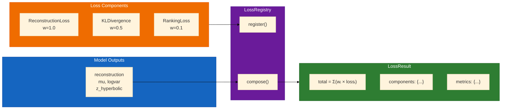

# Loss Functions

The Ternary VAE uses a modular loss system based on the **LossRegistry** pattern for dynamic composition.

## Loss Registry Pattern



Instead of subclassing, losses are composed via a registry:

```python
from src.losses import LossRegistry, ReconstructionLossComponent, KLDivergenceLossComponent

# Create registry
registry = LossRegistry()

# Register components
registry.register("reconstruction", ReconstructionLossComponent(weight=1.0))
registry.register("kl", KLDivergenceLossComponent(weight=0.5))

# Compute losses
result = registry.compose(outputs, targets)
print(result.total)  # Weighted sum
print(result.components)  # {"reconstruction": ..., "kl": ...}
```

## Creating from Config

```python
from src.losses import create_registry_from_training_config
from src.config import TrainingConfig

config = TrainingConfig(
    loss_weights={"reconstruction": 1.0, "kl_divergence": 0.5, "ranking": 0.1}
)

registry = create_registry_from_training_config(config)
```

## When to Use Each Loss

Use this decision guide to select appropriate losses for your use case:

| Use Case | Recommended Losses | Weights |
|----------|-------------------|---------|
| **Basic VAE training** | Reconstruction + KL | 1.0, 0.5 |
| **Hierarchical data** | + Ranking + Radial | 0.1, 0.1 |
| **Vaccine design** | + Glycan + Autoimmune | 0.1, 0.1 |
| **Codon optimization** | + Co-Evolution | 0.2 |
| **Diversity needed** | + Entropy + Repulsion | 0.01, 0.1 |

### Quick Decision Tree

```
Start with: Reconstruction (1.0) + KL (0.5)
              │
              ├─ Getting posterior collapse?
              │   └─ Reduce KL weight OR add free_bits
              │
              ├─ Need hierarchical structure?
              │   └─ Add Ranking (0.1) + RadialStratification (0.1)
              │
              ├─ Latent space collapse (all points clustered)?
              │   └─ Add Repulsion (0.1) + Entropy (0.01)
              │
              └─ Domain-specific requirements?
                  └─ Add specialized losses (Glycan, Autoimmune, etc.)
```

---

## Core Loss Components

### ReconstructionLoss

Cross-entropy loss for reconstructing ternary operations.

**When to use**: Always. This is the primary learning signal.

```python
from src.losses import ReconstructionLossComponent

loss = ReconstructionLossComponent(weight=1.0)
# Input: outputs["reconstruction"] (B, 19683), targets (B,)
```

**Weight guidance**: Start at 1.0. Rarely needs adjustment.

### KL Divergence

Hyperbolic KL divergence with optional free bits.

**When to use**: Always. Regularizes the latent space.

```python
from src.losses import KLDivergenceLossComponent

loss = KLDivergenceLossComponent(
    weight=0.5,
    free_bits=0.5,  # Minimum KL per dimension
)
```

**Weight guidance**:
- Start at 0.5-1.0
- Reduce to 0.1-0.3 if experiencing posterior collapse
- Use `free_bits=0.5` to prevent complete collapse

### Ranking Loss

3-adic valuation-based ranking.

**When to use**: When you need hierarchical structure in the latent space (phylogenetics, protein families).

```python
from src.losses import PAdicRankingLossComponent

loss = PAdicRankingLossComponent(
    weight=0.1,
    margin=1.0,
    n_triplets=100,
)
```

**Weight guidance**: 0.05-0.2. Higher values enforce stronger hierarchy but may hurt reconstruction.

## Advanced Losses

### Radial Stratification

Enforces hierarchical structure based on 3-adic valuations.

**When to use**: When working with ternary operations where divisibility by 3 has semantic meaning. Pairs well with Ranking loss.

```python
from src.losses import RadialStratificationLossComponent

loss = RadialStratificationLossComponent(
    weight=0.1,
    n_strata=9,  # Number of valuation levels
)
```

**Weight guidance**: 0.05-0.2. Use with Ranking loss for best results.

### Entropy Regularization

Encourages diversity in latent space.

**When to use**: When you want a wider spread of points across the latent space. Helps with generation diversity.

```python
from src.losses import EntropyLossComponent

loss = EntropyLossComponent(
    weight=0.01,
    target_entropy=2.0,
)
```

**Weight guidance**: 0.001-0.05. Start small—too high causes training instability.

### Repulsion Loss

Prevents latent space collapse.

**When to use**: When points cluster too tightly together. Particularly useful when KL weight is low.

```python
from src.losses import RepulsionLossComponent

loss = RepulsionLossComponent(
    weight=0.1,
    sigma=0.1,
)
```

**Weight guidance**: 0.05-0.2. Adjust `sigma` based on your latent space scale.

## Specialized Losses

### Hyperbolic Losses

```python
from src.losses import HyperbolicPrior, HyperbolicReconLoss

# Prior matching in hyperbolic space
prior = HyperbolicPrior(curvature=1.0)

# Reconstruction respecting geometry
recon = HyperbolicReconLoss(curvature=1.0)
```

### p-Adic Losses

```python
from src.losses import PAdicMetricLoss, PAdicNormLoss

# Metric alignment
metric = PAdicMetricLoss(p=3)

# Norm regularization
norm = PAdicNormLoss(p=3, target_norm=1.0)
```

### Co-Evolution Losses

```python
from src.losses import (
    CoEvolutionLoss,
    BiosyntheticCoherenceLoss,
    ErrorMinimizationLoss,
)

coevo = CoEvolutionLoss(
    biosynthetic_weight=0.5,
    error_weight=0.3,
)
```

### Glycan Shield Analysis

```python
from src.losses import SentinelGlycanLoss, GlycanShieldAnalyzer

glycan = SentinelGlycanLoss(
    weight=0.1,
    n_sites=5,
)
```

### Autoimmune Regularization

```python
from src.losses import AutoimmuneCodonRegularizer, CD4CD8AwareRegularizer

auto = AutoimmuneCodonRegularizer(
    weight=0.1,
    human_codon_bias=True,
)
```

## Loss Result

All losses return a `LossResult` dataclass:

```python
from src.losses import LossResult

result: LossResult
# result.total: torch.Tensor (scalar)
# result.components: dict[str, torch.Tensor]
# result.metrics: dict[str, float]
```

## Loss Groups

Organize related losses:

```python
from src.losses import LossGroup

group = LossGroup("reconstruction_group")
group.add("main_recon", ReconstructionLossComponent(1.0))
group.add("aux_recon", ReconstructionLossComponent(0.1))

registry.register_group(group)
```

## Custom Loss Components

Implement the `LossComponent` protocol:

```python
from src.losses import LossComponent, LossResult

class MyCustomLoss(LossComponent):
    def __init__(self, weight: float = 1.0):
        self.weight = weight

    def compute(
        self,
        outputs: dict,
        targets: torch.Tensor,
    ) -> LossResult:
        # Your loss computation
        loss = ...
        return LossResult(
            total=self.weight * loss,
            components={"my_loss": loss},
            metrics={"my_metric": ...},
        )
```

## See Also

- [[Training]] - Using losses in training
- [[Configuration]] - Configuring loss weights
- [[Geometry]] - Hyperbolic loss theory
